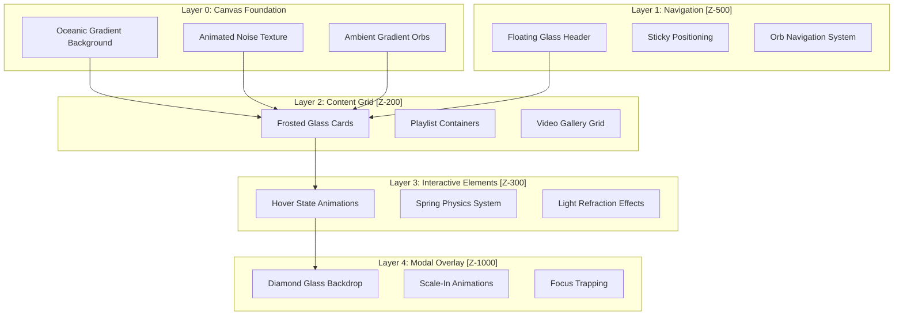
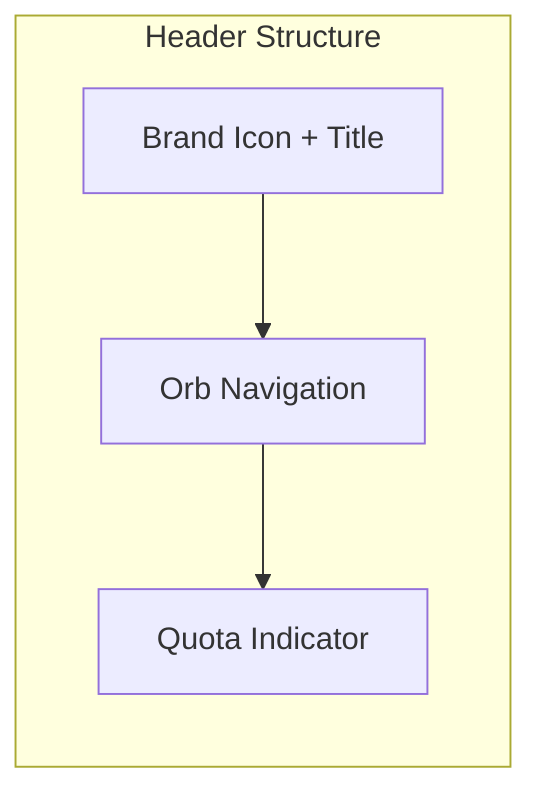
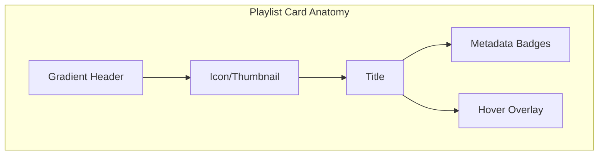
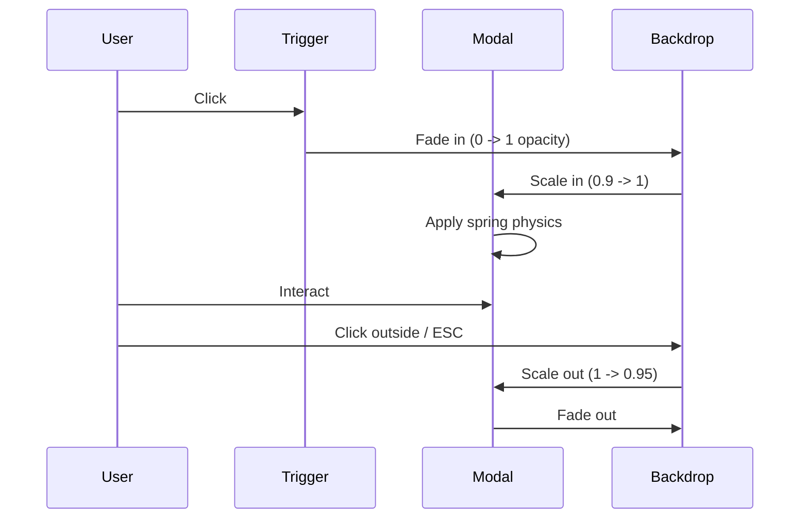

# Playlist Navigator Pro - Liquid Glass Redesign Specification

## Overview

This document specifies the complete redesign of the Playlist Navigator Pro frontend using the Liquid Glass design language. The redesign transforms the existing basic UI into a sophisticated, multi-layered glassmorphic interface with fluid animations, reactive lighting, and immersive depth perception.

## Architecture Overview



## 1. Visual Layer System (5-Layer Glass Hierarchy)

### Layer 1: Frosted Glass - Base UI Containers
```css
.liquid-glass-1 {
  background: rgba(255, 255, 255, var(--liquid-opacity-1)); /* 3% */
  backdrop-filter: blur(var(--liquid-blur-1)) saturate(var(--liquid-saturate-1));
  border: 1px solid var(--liquid-border-1);
  border-radius: var(--liquid-radius-md);
  box-shadow: var(--liquid-shadow-1);
}
```
**Usage:** Form containers, list backgrounds, secondary panels

### Layer 2: Translucent Glass - Interactive Elements
```css
.liquid-glass-2 {
  background: rgba(255, 255, 255, var(--liquid-opacity-2)); /* 6% */
  backdrop-filter: blur(var(--liquid-blur-2)) saturate(var(--liquid-saturate-2));
  border: 1px solid var(--liquid-border-2);
  border-radius: var(--liquid-radius-lg);
  box-shadow: var(--liquid-shadow-2);
}
```
**Usage:** Playlist cards, buttons, input fields

### Layer 3: Crystal Glass - Floating Elements
```css
.liquid-glass-3 {
  background: rgba(255, 255, 255, var(--liquid-opacity-3)); /* 10% */
  backdrop-filter: blur(var(--liquid-blur-3)) saturate(var(--liquid-saturate-3));
  border: 1px solid var(--liquid-border-3);
  border-radius: var(--liquid-radius-xl);
  box-shadow: var(--liquid-shadow-3);
}
```
**Usage:** Video cards, primary action buttons, tooltips

### Layer 4: Premium Glass - Elevated Elements
```css
.liquid-glass-4 {
  background: rgba(255, 255, 255, var(--liquid-opacity-4)); /* 15% */
  backdrop-filter: blur(var(--liquid-blur-3)) saturate(var(--liquid-saturate-4));
  border: 1px solid var(--liquid-border-4);
  border-radius: var(--liquid-radius-2xl);
  box-shadow: var(--liquid-shadow-4);
}
```
**Usage:** Detail panels, expanded cards, prominent alerts

### Layer 5: Diamond Glass - Modal Overlays
```css
.liquid-glass-5 {
  background: rgba(15, 20, 35, var(--liquid-opacity-5)); /* 85% */
  backdrop-filter: blur(var(--liquid-blur-4)) saturate(var(--liquid-saturate-4));
  border: 1px solid var(--liquid-border-4);
  border-radius: var(--liquid-radius-xl);
  box-shadow: var(--liquid-shadow-modal);
}
```
**Usage:** Modal dialogs, full-screen overlays, critical alerts

## 2. Component Specifications

### 2.1 Floating Glass Header



**Specifications:**
- Position: Fixed, top: 1rem, left/right: 1rem
- Background: rgba(255, 255, 255, 0.04)
- Backdrop blur: 20px, saturate: 200%
- Border: 1px solid rgba(255, 255, 255, 0.08)
- Border-radius: 9999px (pill shape)
- Z-index: 500
- Responsive: Collapses to hamburger menu on mobile (<768px)

**Orb Navigation System:**
- Pills arranged horizontally with 0.5rem gap
- Active state: Gradient background with cyan glow
- Hover: Slight lift (-2px translateY) with background highlight
- Transition: 300ms cubic-bezier(0.34, 1.56, 0.64, 1)

### 2.2 Playlist Grid Containers



**Specifications:**
- Container: liquid-glass-2 class
- Grid: Auto-fill, minmax(300px, 1fr), gap: 1.5rem
- Header gradient: Dynamic based on playlist color scheme
- Hover effect: translateY(-8px) scale(1.02) with shadow expansion
- Shine sweep: Diagonal gradient animation on hover
- Border accent: Cyan tint on hover state

### 2.3 Video Gallery Cards

**Specifications:**
- Container: liquid-glass-2 with overflow-hidden
- Thumbnail: 16:9 aspect ratio with object-fit: cover
- Play overlay: Glass circle with scale animation
- Duration badge: Bottom-right, glass background
- Title: Line-clamp-2 for consistency
- Meta: Channel name + view count

### 2.4 Modal Dialogs



**Specifications:**
- Backdrop: Diamond glass (layer 5) with 85% opacity
- Entry animation: Scale from 0.9 with spring easing
- Exit animation: Scale to 0.95 with opacity fade
- Focus trapping: Tab cycles within modal only
- Close triggers: ESC key, backdrop click, X button
- Z-index: 1000 (above all other content)

### 2.5 Form Elements

**Glass Input Fields:**
- Container: liquid-glass-1 with focus state glow
- Label: Floating label pattern
- Border: Bottom-only with cyan focus indicator
- Placeholder: 40% white opacity
- Glow effect: Radial gradient on focus

**Glass Buttons:**
- Primary: Cyan gradient with glow shadow
- Secondary: Transparent with white border
- Hover: Lift effect with shine sweep
- Active: Scale down (0.98)

## 3. Animation System

### 3.1 Spring Physics Configuration

```javascript
// Spring presets for liquid dynamics
const SPRING_PRESETS = {
  gentle: { stiffness: 200, damping: 25, mass: 1 },
  snappy: { stiffness: 400, damping: 30, mass: 1 },
  bouncy: { stiffness: 300, damping: 15, mass: 1 },
  stiff: { stiffness: 500, damping: 40, mass: 1 }
};
```

### 3.2 Transition Specifications

| Animation | Duration | Easing | Properties |
|-----------|----------|--------|------------|
| Card hover | 300ms | spring | transform, box-shadow |
| Tab switch | 400ms | liquid | opacity, transform |
| Modal enter | 500ms | spring | transform, opacity |
| Modal exit | 300ms | smooth | transform, opacity |
| Button press | 150ms | smooth | transform |
| Shine sweep | 600ms | smooth | translateX |
| Stagger children | 80ms delay | spring | opacity, translateY |

### 3.3 Cursor-Responsive Lighting

```javascript
// Light refraction follows cursor
class LightRefraction {
  constructor(element) {
    this.element = element;
    this.throttle = 16; // 60fps
  }
  
  update(mouseX, mouseY) {
    const rect = this.element.getBoundingClientRect();
    const x = ((mouseX - rect.left) / rect.width) * 100;
    const y = ((mouseY - rect.top) / rect.height) * 100;
    
    this.element.style.setProperty('--light-x', `${x}%`);
    this.element.style.setProperty('--light-y', `${y}%`);
  }
}
```

**CSS Implementation:**
```css
.liquid-card-float::before {
  background: radial-gradient(
    circle at var(--light-x, 50%) var(--light-y, 50%),
    rgba(255, 255, 255, 0.15) 0%,
    transparent 50%
  );
}
```

## 4. Responsive Behavior

### 4.1 Breakpoint Strategy

| Breakpoint | Width | Key Changes |
|------------|-------|-------------|
| Mobile | < 480px | Single column, hamburger nav, reduced blur |
| Tablet | 480-768px | 2 columns, condensed header |
| Desktop | 768-1200px | 3 columns, full effects |
| Large | > 1200px | 4 columns, enhanced visuals |

### 4.2 Adaptive Blur Intensity

```javascript
// Performance optimization based on device
function calculateOptimalBlur() {
  const isMobile = window.matchMedia('(pointer: coarse)').matches;
  const prefersReducedMotion = window.matchMedia('(prefers-reduced-motion: reduce)').matches;
  const isLowPower = navigator.hardwareConcurrency <= 4;
  
  if (prefersReducedMotion || isLowPower) {
    return { blur: '4px', opacity: 0.15 };
  }
  
  if (isMobile) {
    return { blur: '8px', opacity: 0.08 };
  }
  
  return { blur: '16px', opacity: 0.1 };
}
```

## 5. Accessibility Standards

### 5.1 Color Contrast Requirements

| Element | Background | Text | Contrast Ratio |
|---------|------------|------|----------------|
| Primary text | 10% white glass | #FFFFFF | 7:1 (AAA) |
| Secondary text | 10% white glass | rgba(255,255,255,0.7) | 4.5:1 (AA) |
| Buttons | Cyan gradient | #FFFFFF | 4.6:1 (AA) |
| Placeholder | 6% white glass | rgba(255,255,255,0.4) | 3:1 (AA Large) |

### 5.2 Keyboard Navigation

- **Tab order**: Logical flow through all interactive elements
- **Focus indicators**: 2px cyan outline with 2px offset
- **Skip links**: "Skip to main content" at page top
- **Modal focus**: Trap focus within modal when open
- **Escape key**: Close modals and dropdowns

### 5.3 Motion Preferences

```css
@media (prefers-reduced-motion: reduce) {
  *,
  *::before,
  *::after {
    animation-duration: 0.01ms !important;
    transition-duration: 0.01ms !important;
  }
  
  .liquid-glass-1,
  .liquid-glass-2,
  .liquid-glass-3 {
    backdrop-filter: none !important;
    background: rgba(20, 25, 40, 0.95) !important;
  }
}
```

## 6. Dynamic Theming System

### 6.1 CSS Custom Properties

```css
:root {
  /* Glass opacity levels (configurable) */
  --glass-opacity-frosted: 0.03;
  --glass-opacity-translucent: 0.06;
  --glass-opacity-crystal: 0.10;
  --glass-opacity-premium: 0.15;
  --glass-opacity-diamond: 0.85;
  
  /* Tint colors */
  --glass-tint-primary: 0, 217, 255;    /* Cyan */
  --glass-tint-secondary: 184, 41, 221; /* Purple */
  --glass-tint-accent: 0, 255, 136;     /* Green */
  
  /* Dynamic blur intensity */
  --glass-blur-intensity: var(--liquid-blur-2);
  
  /* Animation speed */
  --animation-speed: 1; /* Multiplier: 0.5 = half speed, 2 = double */
}
```

### 6.2 Theme Switching API

```javascript
class LiquidTheme {
  static setOpacity(level, value) {
    document.documentElement.style.setProperty(
      `--glass-opacity-${level}`,
      value
    );
  }
  
  static setTint(color, r, g, b) {
    document.documentElement.style.setProperty(
      `--glass-tint-${color}`,
      `${r}, ${g}, ${b}`
    );
  }
  
  static setAnimationSpeed(multiplier) {
    document.documentElement.style.setProperty(
      '--animation-speed',
      multiplier
    );
  }
}
```

## 7. Implementation Phases

### Phase 1: Foundation
1. Integrate liquid-dynamics CSS files
2. Set up CSS custom properties for theming
3. Create base canvas with gradient orbs
4. Implement skip link and focus management

### Phase 2: Navigation
1. Build floating glass header
2. Implement orb navigation system
3. Add mobile hamburger menu
4. Integrate quota indicator with glass styling

### Phase 3: Content Components
1. Transform playlist cards to glass design
2. Build video gallery grid
3. Implement search interface with glass inputs
4. Create indexer form with glass styling

### Phase 4: Interactions
1. Add spring physics to all hover states
2. Implement cursor-responsive lighting
3. Add scroll-based parallax effects
4. Build modal system with animations

### Phase 5: Polish
1. Implement responsive breakpoints
2. Add adaptive blur calculations
3. Test accessibility compliance
4. Performance optimization

## 8. File Structure

```
templates/
  index.html                    # Main template (redesigned)
  
static/
  css/
    liquid-theme.css           # Dynamic theming variables
    liquid-components.css      # Component-specific styles
    liquid-animations.css      # Animation keyframes
    liquid-responsive.css      # Breakpoint adaptations
  
  js/
    liquid-init.js            # Initialization and feature detection
    liquid-interactions.js    # Hover, click, focus handlers
    liquid-animations.js      # Spring physics and transitions
    liquid-accessibility.js   # ARIA and keyboard navigation
    app-liquid.js             # App logic with liquid integration
```

## 9. Performance Considerations

### 9.1 GPU Acceleration
- Use `transform` and `opacity` for animations
- Apply `will-change` strategically (add before, remove after)
- Use `contain: paint layout` for isolated components

### 9.2 Backdrop Filter Optimization
- Limit blur radius on mobile devices
- Disable on low-power mode
- Use `content-visibility: auto` for off-screen content

### 9.3 JavaScript Performance
- Throttle mousemove events to 60fps
- Use `requestAnimationFrame` for smooth animations
- Implement intersection observer for lazy effects
- Debounce scroll handlers

## 10. Component CSS Reference

### 10.1 Dynamic Theme Variables

```css
:root {
  /* Extended glass opacity levels for runtime theming */
  --glass-opacity-frosted: var(--liquid-opacity-1);
  --glass-opacity-translucent: var(--liquid-opacity-2);
  --glass-opacity-crystal: var(--liquid-opacity-3);
  --glass-opacity-premium: var(--liquid-opacity-4);
  --glass-opacity-diamond: var(--liquid-opacity-5);
  
  /* Dynamic tint colors (RGB format for rgba usage) */
  --glass-tint-primary: 0, 217, 255;      /* Cyan */
  --glass-tint-secondary: 184, 41, 221;   /* Purple */
  --glass-tint-accent: 0, 255, 136;       /* Green */
  --glass-tint-warm: 233, 69, 96;         /* Pink/Red */
  
  /* Light refraction tracking */
  --light-x: 50%;
  --light-y: 50%;
  --light-intensity: 0.15;
  
  /* Animation speed multiplier */
  --animation-speed: 1;
  
  /* Adaptive blur based on device capability */
  --adaptive-blur-1: var(--liquid-blur-1);
  --adaptive-blur-2: var(--liquid-blur-2);
  --adaptive-blur-3: var(--liquid-blur-3);
  --adaptive-blur-4: var(--liquid-blur-4);
}
```

### 10.2 Floating Header Specification

```css
.liquid-header-float {
  position: fixed;
  top: var(--liquid-space-4);
  left: var(--liquid-space-4);
  right: var(--liquid-space-4);
  z-index: var(--liquid-z-navigation);
  padding: var(--liquid-space-3) var(--liquid-space-5);
  background: rgba(255, 255, 255, 0.04);
  backdrop-filter: blur(20px) saturate(200%);
  border: 1px solid rgba(255, 255, 255, 0.08);
  border-radius: var(--liquid-radius-full);
  box-shadow: 
    0 8px 32px rgba(0, 0, 0, 0.3),
    inset 0 1px 0 rgba(255, 255, 255, 0.1);
  transition: all var(--liquid-duration-base) var(--liquid-ease-smooth);
}

.liquid-header-float.scrolled {
  top: 0;
  left: 0;
  right: 0;
  border-radius: 0;
  background: rgba(10, 14, 31, 0.85);
}
```

### 10.3 Light Refraction Effect

```css
/* Light refraction follows cursor on cards */
.liquid-card-playlist::after {
  content: '';
  position: absolute;
  inset: 0;
  background: radial-gradient(
    circle at var(--light-x, 50%) var(--light-y, 50%),
    rgba(255, 255, 255, var(--light-intensity)) 0%,
    transparent 50%
  );
  opacity: 0;
  transition: opacity var(--liquid-duration-base);
  pointer-events: none;
}

.liquid-card-playlist:hover::after {
  opacity: 1;
}
```

### 10.4 Spring Physics Card Hover

```css
.liquid-card-playlist {
  transition: all var(--liquid-duration-base) var(--liquid-ease-spring);
  transform-style: preserve-3d;
}

.liquid-card-playlist:hover {
  transform: translateY(-8px) scale(1.02);
  box-shadow: 
    0 24px 64px rgba(0, 0, 0, 0.4),
    0 0 40px rgba(var(--glass-tint-primary), 0.1);
  border-color: rgba(var(--glass-tint-primary), 0.3);
}
```

### 10.5 Modal Scale-In Animation

```css
.liquid-modal-backdrop {
  position: fixed;
  inset: 0;
  background: rgba(10, 14, 31, 0.85);
  backdrop-filter: blur(var(--liquid-blur-4));
  z-index: var(--liquid-z-modal);
  opacity: 0;
  visibility: hidden;
  transition: opacity var(--liquid-duration-base), visibility var(--liquid-duration-base);
}

.liquid-modal-backdrop.active {
  opacity: 1;
  visibility: visible;
}

.liquid-modal {
  transform: scale(0.9) translateY(20px);
  opacity: 0;
  transition: 
    transform var(--liquid-duration-slow) var(--liquid-ease-spring),
    opacity var(--liquid-duration-base);
}

.liquid-modal-backdrop.active .liquid-modal {
  transform: scale(1) translateY(0);
  opacity: 1;
}
```

## 11. Testing Checklist

- [ ] Visual: All 5 glass layers render correctly
- [ ] Animation: Spring physics feel natural
- [ ] Responsive: Layout adapts at all breakpoints
- [ ] Accessibility: Keyboard navigation works
- [ ] Accessibility: Screen reader compatibility
- [ ] Performance: 60fps on mid-range devices
- [ ] Compatibility: Graceful degradation without backdrop-filter
- [ ] Theming: Dynamic property changes apply instantly

## 12. Migration Guide from Current UI

### Current Structure → New Structure

| Current Class | New Liquid Class | Notes |
|---------------|------------------|-------|
| `.app-header` | `.liquid-header-float` | Full glass transformation |
| `.tab-btn` | `.liquid-nav-orb` | Orb-style with glow |
| `.playlist-card` | `.liquid-card-playlist` | Added hover physics |
| `.video-card` | `.liquid-card-video` | Glass + play overlay |
| `.input-group` | `.liquid-input-wrap` | Floating label style |
| `.submit-btn` | `.liquid-btn-primary` | Gradient + shine |
| `.status-panel` | `.liquid-progress` | Animated shimmer |
| `.empty-state` | `.liquid-empty` | Pulsing glow icon |

## 13. Implementation Checklist for Code Mode

### Phase 1: CSS Integration
- [ ] Copy liquid-variables.css to static/css/
- [ ] Copy liquid-core.css to static/css/
- [ ] Create liquid-components.css with component styles
- [ ] Add Google Fonts (Rajdhani, Plus Jakarta Sans, IBM Plex Mono)

### Phase 2: HTML Transformation
- [ ] Add `liquid-canvas` class to body
- [ ] Transform header to `liquid-header-float`
- [ ] Convert tabs to `liquid-nav-orb` system
- [ ] Update all cards to glass design
- [ ] Transform forms to glass inputs
- [ ] Add ambient gradient orbs

### Phase 3: JavaScript Integration
- [ ] Import LiquidDynamics.js
- [ ] Initialize on DOMContentLoaded
- [ ] Add cursor tracking for light refraction
- [ ] Implement scroll-based header transform
- [ ] Add spring physics to card hovers
- [ ] Create modal management system

### Phase 4: Polish & Testing
- [ ] Test all 6 tabs with new design
- [ ] Verify keyboard navigation
- [ ] Check color contrast ratios
- [ ] Test responsive breakpoints
- [ ] Verify reduced motion support
- [ ] Test without backdrop-filter support

## 14. Key Files to Create/Modify

### New Files:
1. `static/css/liquid-theme.css` - Extended theming variables
2. `static/css/liquid-responsive.css` - Breakpoint adaptations
3. `static/js/liquid-app-integration.js` - App-specific interactions

### Modified Files:
1. `templates/index.html` - Complete redesign
2. `static/css/style.css` - Legacy compatibility layer
3. `static/js/app.js` - Add liquid dynamics initialization

## 15. Expected File Size Impact

- CSS additions: ~15KB (compressed ~3KB)
- JavaScript additions: ~5KB (compressed ~2KB)
- Font loading: ~150KB (cached after first load)
- Total additional load: ~170KB initial, ~5KB cached
