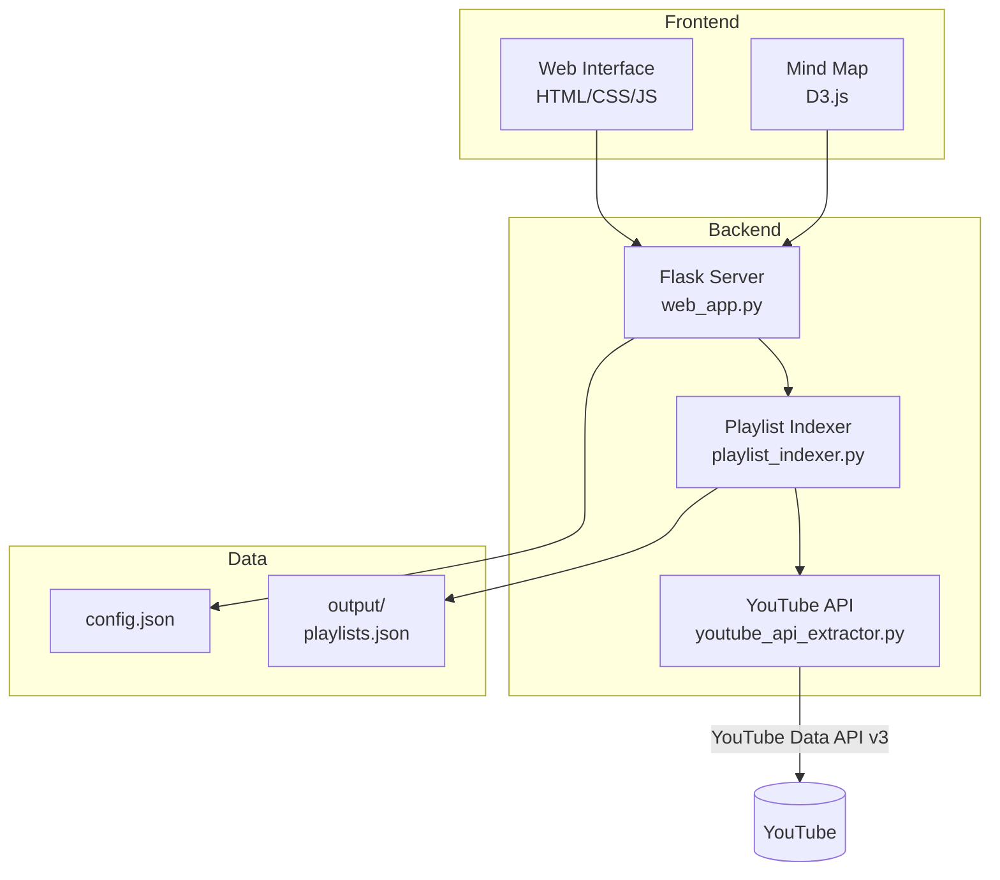
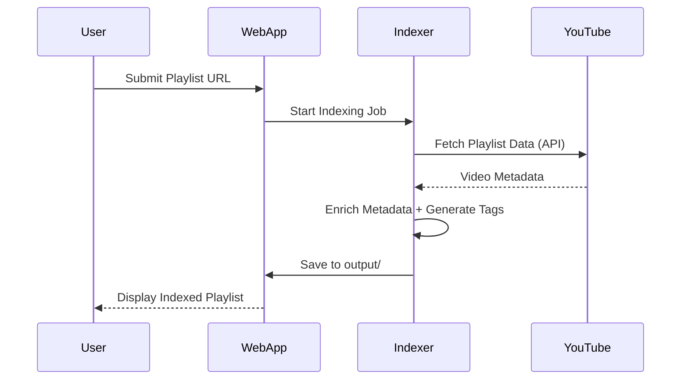

# 🎬 Playlist Navigator Pro

**Your personal YouTube playlist organizer, indexer, and explorer.**

[](https://www.python.org/downloads/)
[](https://flask.palletsprojects.com/)
[](LICENSE)

---

## ✨ Features

- 🔍 **Index YouTube Playlists** — Extract video metadata via YouTube Data API
- 🏷️ **Smart Tagging** — Auto-generated + user-defined tags
- 📊 **Video Store** — Filter by category, duration, channel
- 🧠 **Mind Map** — Interactive D3.js graph visualization
- 📥 **Excel Export** — Download filtered results to spreadsheet
- 🔎 **Master Search** — Search across all indexed playlists
- 🎨 **Color Schemes** — Purple, Teal, Blue, Green themes
- 📦 **Standalone EXE** — No Python installation required (Windows)

---

## 🏗️ Architecture



---

## 🚀 Quick Start

### Option 1: Standalone EXE (Windows)

1. Download `PlaylistIndexer.zip` from [Releases](https://github.com/YOUR_USERNAME/playlist-navigator-pro/releases)
2. Extract and run `PlaylistIndexer.exe`
3. Browser opens automatically to `http://localhost:5000`

### Option 2: Run from Source

```bash
# Clone repository
git clone https://github.com/YOUR_USERNAME/playlist-navigator-pro.git
cd playlist-navigator-pro

# Create virtual environment
python -m venv .venv
source .venv/bin/activate  # Windows: .venv\Scripts\activate

# Install dependencies
pip install -r requirements.txt

# Add your YouTube API key to config.json
# Get one from: https://console.cloud.google.com/

# Run the application
python web_app.py
```

---

## 📁 Project Structure

```
playlist-navigator-pro/
├── docs/                   # Documentation
│   ├── Brainstorm.md       # Feature ideas
│   └── QUICK_START_GUIDE.md
├── execution/              # Backend modules
│   ├── delta_sync.py       # Playlist sync logic
│   ├── excel_exporter.py   # Excel export
│   ├── graph_generator.py  # Mind map data
│   ├── metadata_enricher.py
│   └── models.py           # Pydantic models
├── static/                 # Frontend assets
│   ├── css/
│   └── js/
├── templates/              # Jinja2 templates
├── tests/                  # Test suite
├── config.json             # Configuration
├── playlist_indexer.py     # Core indexing logic
├── web_app.py              # Flask application
├── youtube_api_extractor.py
└── requirements.txt
```

---

## ⚙️ Configuration

Store secrets in `.env` or environment variables:

```bash
YOUTUBE_API_KEY=YOUR_YOUTUBE_KEY
GEMINI_API_KEY=YOUR_GEMINI_KEY
```

---

## 🔄 Data Flow



---

## 🧪 Running Tests

```bash
pytest tests/ -v
```

---

## 📄 License

MIT License — see [LICENSE](LICENSE) for details.

---

## 🤝 Contributing

Contributions welcome! Please open an issue first to discuss proposed changes.

1. Fork the repository
2. Create your feature branch (`git checkout -b feature/amazing-feature`)
3. Commit your changes (`git commit -m 'Add amazing feature'`)
4. Push to the branch (`git push origin feature/amazing-feature`)
5. Open a Pull Request

---

<p align="center">
  Made with ❤️ for playlist enthusiasts
</p>
