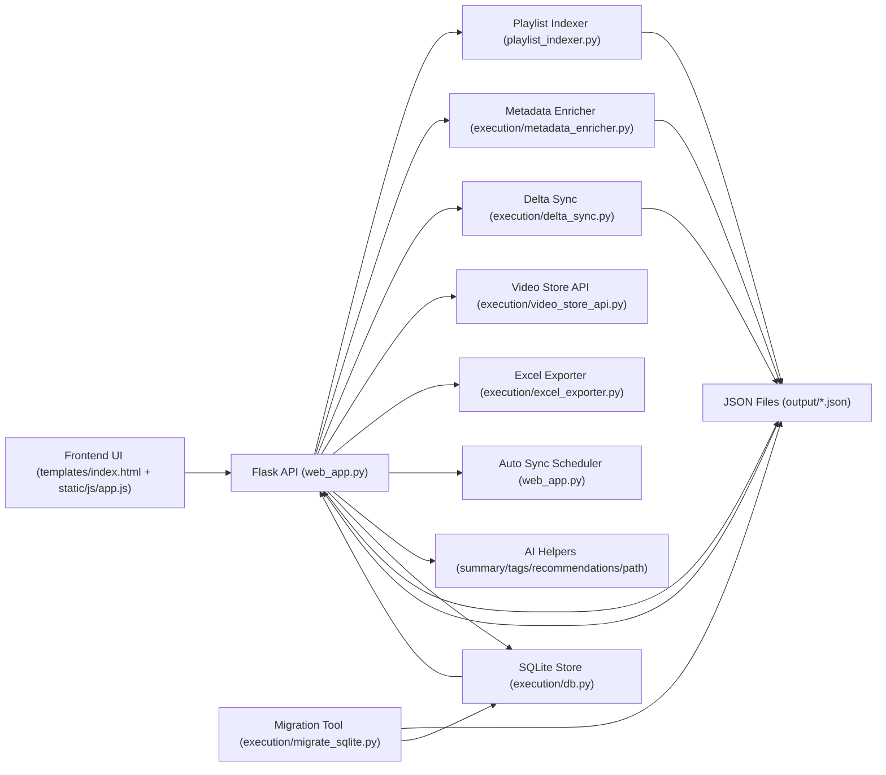
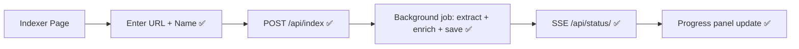
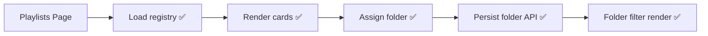
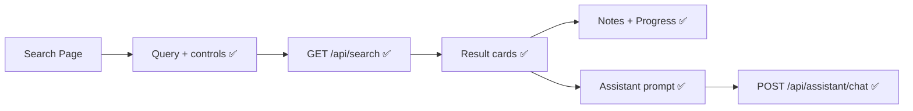
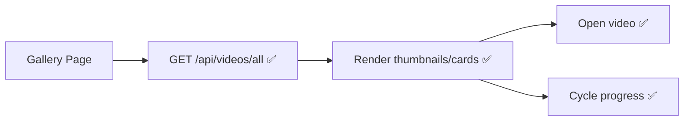
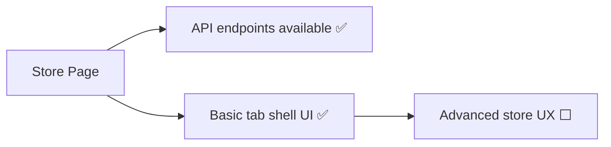

# Playlist Navigator Pro - User Manual

## 1. Overview
Playlist Navigator Pro indexes YouTube playlists, enriches metadata, and provides:
- playlist browsing
- cross-playlist search
- tagging and notes
- Excel export
- analytics
- optional AI helper endpoints
- JSON or SQLite storage backends

---

## 2. Architecture (Integrated Functions)



---

## 3. Getting Started

### 3.1 Requirements
- Python 3.10+
- Dependencies from `requirements.txt`
- YouTube Data API key in `config.json` for live indexing

### 3.2 Run
1. Install dependencies:
   - `pip install -r requirements.txt`
2. Start app:
   - `python web_app.py`
3. Open:
   - `http://localhost:5000`

---

## 4. Configuration
Main file: `config.json`

Important runtime keys:
- `data_backend`: `sqlite` or `json`
- `sqlite_path`: SQLite DB path (relative or absolute)
- `auto_sync.enabled`: scheduler on/off
- `auto_sync.interval_minutes`: scheduler interval
- `youtube_api_key`: required for playlist extraction

Example:
```json
{
  "data_backend": "sqlite",
  "sqlite_path": "output/playlist_indexer.db",
  "auto_sync": {
    "enabled": false,
    "interval_minutes": 60
  }
}
```

---

## 5. Core UI Workflows

### 5.1 Index Playlist
Implemented (`✅`):
- `✅` Playlist URL + name form
- `✅` Color scheme selection
- `✅` SSE progress updates (`/api/status/<job_id>`)
- `✅` Duplicate check path (`/api/index` with conflict handling)



### 5.2 Playlists
Implemented (`✅`):
- `✅` Load playlists (`GET /api/playlists`)
- `✅` Folder assignment (`POST /api/playlists/<id>/folder`)
- `✅` Folder list (`GET /api/folders`)
- `✅` Folder filter in UI
- `✅` Grid/List view toggle with persistence



### 5.3 Search
Implemented (`✅`):
- `✅` Full-text search (`GET /api/search`)
- `✅` Logic mode (`AND` / `OR`)
- `✅` Description include toggle
- `✅` Smart filters + progress filters
- `✅` Search history + saved searches (localStorage)
- `✅` Notes editor (`POST /api/videos/<id>/notes`)
- `✅` Progress cycle state (`not_started` / `in_progress` / `completed`)
- `✅` Assistant panel (`POST /api/assistant/chat`)



### 5.4 Gallery
Implemented (`✅`):
- `✅` All videos feed (`GET /api/videos/all`)
- `✅` Visual gallery render
- `✅` Grid/List toggle
- `✅` Quick open link
- `✅` Progress cycle quick action



### 5.5 Store
Implemented (`✅`) and placeholder (`⬜`):
- `✅` Store API endpoints (`/api/store/categories`, `/api/store/filters`, `/api/store/search`)
- `⬜` Advanced store UX is still minimal in current UI tab



### 5.6 Mind Map
Implemented (`✅`) and placeholder (`⬜`):
- `✅` Mind map API route (`GET /api/graph/mindmap`)
- `✅` Mind map tab scaffold
- `⬜` Rich interactive graph UX remains limited


---

## 6. Storage Backends

### 6.1 SQLite (default)
- Primary backend for current architecture.
- Centralized reads/writes via `execution/db.py`.

### 6.2 JSON
- Backward-compatible mode for existing data.
- Files under `output/`.

### 6.3 Migration
- Use `execution/migrate_sqlite.py` to migrate JSON -> SQLite.
- Supports parity checks and dry-run.

---

## 7. API Endpoints (Key)

### Indexing and data
- `POST /api/index`
- `POST /api/sync/delta/<playlist_id>`
- `GET /api/playlists`
- `GET /api/playlist/<playlist_id>`
- `GET /api/videos/all`

### Search and tags
- `GET /api/search`
- `GET /api/tags`
- `POST /api/videos/<video_id>/tags`
- `DELETE /api/videos/<video_id>/tags/<tag_name>`
- `POST /api/videos/<video_id>/notes`

### Folders
- `POST /api/playlists/<playlist_id>/folder`
- `GET /api/folders`

### Exports and graph
- `GET /api/export/excel`
- `GET /api/graph/mindmap`

### Scheduler and analytics
- `GET /api/analytics/summary`
- `GET /api/scheduler/status`
- `POST /api/scheduler/config`
- `POST /api/scheduler/run-once`

### Assistant and AI helpers
- `POST /api/assistant/chat`
- `GET /api/ai/summary/<video_id>`
- `GET /api/ai/suggest-tags/<video_id>`
- `GET /api/ai/recommendations/<video_id>`
- `GET /api/ai/difficulty-path`

---

## 8. Troubleshooting

### 8.1 No search results
- Confirm playlists were indexed.
- Check backend mode (`sqlite` vs `json`) matches your data.

### 8.2 Folder/note updates not visible
- Reload page (local UI cache + backend write timing).
- Verify backend route responses in browser network tab.

### 8.3 Migration issues
- Run migration in dry-run first.
- Confirm `playlists.json` and `*_data.json` are valid.

### 8.4 Scheduler not running
- Check `GET /api/scheduler/status`
- Ensure `auto_sync.enabled=true`
- Validate interval (`>= 5` minutes)

---

## 9. Verification Checklist
- App starts with `python web_app.py`
- Indexing job completes
- Search returns expected results
- Notes and folders persist
- Analytics endpoint returns non-empty summary
- Scheduler status/config/run-once endpoints work
- AI helper endpoints return structured JSON
