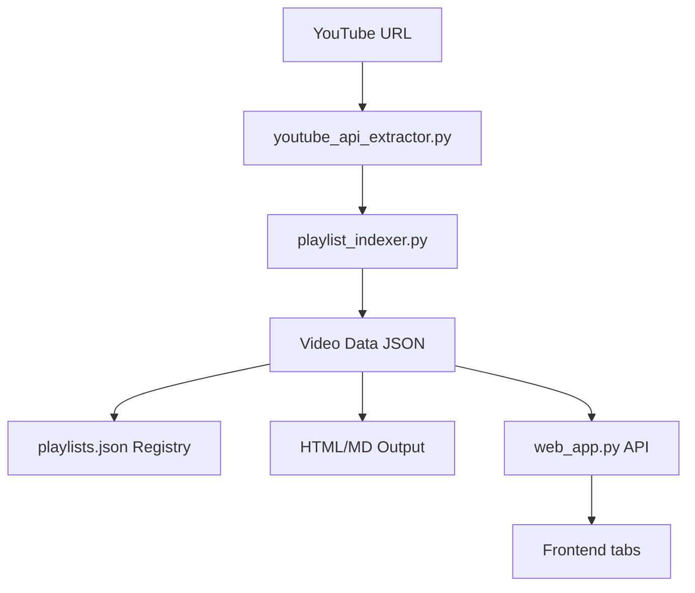
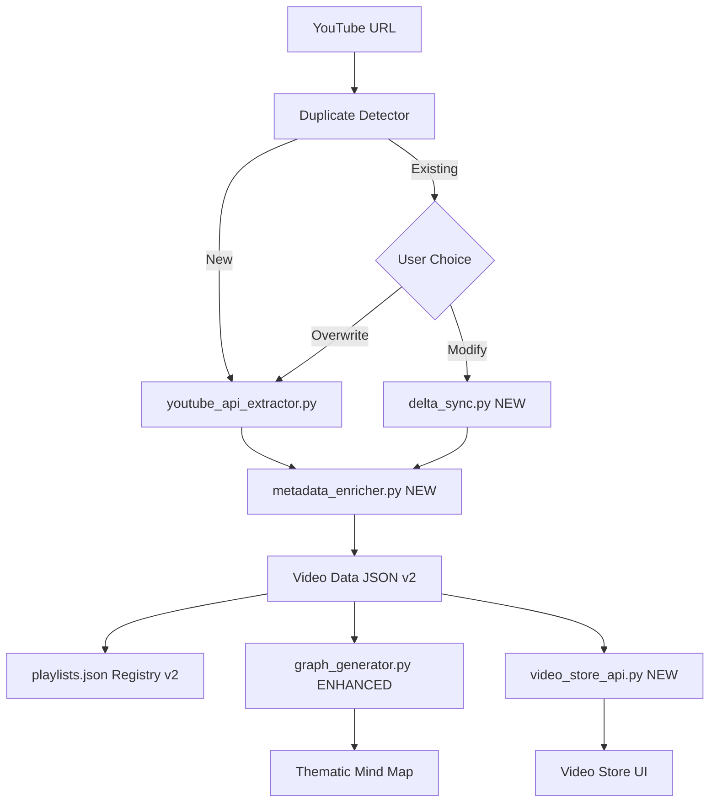

# Master Plan: Advanced Metadata Management & Navigation Upgrade

## Executive Summary

This document provides a comprehensive, step-by-step implementation plan for upgrading the Playlist Indexer with:
1. **No Duplicate Playlists Rule** - Overwrite vs Modification (delta update) logic
2. **Enhanced Metadata Schema** - Thematics, genres, authors, and length categorization
3. **Video Store Interface** - Browse and filter videos by metadata attributes
4. **Thematic Mind Map** - Metadata-driven visualization
5. **Comprehensive Test Suite** - pytest-based testing for all features

---

## 1. Architecture Overview

### 1.1 Current Data Flow



### 1.2 Proposed Enhanced Data Flow



---

## 2. Enhanced Metadata Schema

### 2.1 Current Video Data Structure

```json
{
  "title": "string",
  "url": "string",
  "channel": "string",
  "video_id": "string",
  "published_at": "ISO8601",
  "thumbnail": "string",
  "description": "string",
  "duration": "ISO8601 duration",
  "view_count": "number",
  "like_count": "number",
  "tags": ["array of strings"],
  "playlist_id": "string",
  "playlist_name": "string"
}
```

### 2.2 Enhanced Video Data Structure (v2)

```json
{
  "video_id": "string",
  "title": "string",
  "url": "string",
  "channel": "string",
  "channel_id": "string",
  "published_at": "ISO8601",
  "indexed_at": "ISO8601",
  "last_synced_at": "ISO8601",
  "thumbnail": "string",
  "description": "string",
  "duration": "ISO8601 duration",
  "duration_seconds": "number",
  "view_count": "number",
  "like_count": "number",
  
  "metadata": {
    "thematic": {
      "primary": "string",
      "secondary": ["array"],
      "confidence": "number 0-1"
    },
    "genre": {
      "primary": "string",
      "all": ["array"]
    },
    "author_type": "string",
    "length_category": "string",
    "content_type": "string",
    "difficulty_level": "string"
  },
  
  "tags": {
    "youtube_tags": ["array"],
    "auto_generated": ["array"],
    "user_defined": ["array"],
    "combined": ["array"]
  },
  
  "playlist_memberships": [
    {
      "playlist_id": "string",
      "playlist_name": "string",
      "added_at": "ISO8601"
    }
  ],
  
  "sync_status": {
    "exists_at_source": "boolean",
    "last_verified": "ISO8601"
  }
}
```

### 2.3 Metadata Classification Rules

#### 2.3.1 Thematic Categories
| Thematic | Keywords/Patterns |
|----------|-------------------|
| DIY Electronics | diy, build, solder, pcb, circuit, schematic |
| Audio/Music | synth, audio, music, sound, midi, dsp |
| Programming | code, programming, firmware, software, api |
| Tutorials | tutorial, guide, how to, learn, beginner |
| Reviews | review, comparison, vs, test, analysis |
| Hardware | hardware, microcontroller, arduino, teensy, daisy |
| Agriculture/Science | soil, plant, weather, sensor, monitoring |
| AI/ML | ai, llm, machine learning, neural, gpt |

#### 2.3.2 Genre Classification
| Genre | Criteria |
|-------|----------|
| Educational | tutorial, guide, explanation focus |
| Demo | demonstration, showcase, walkthrough |
| Review | opinion, comparison, analysis |
| Live Session | live, stream, workshop |
| Documentary | in-depth, history, journey |
| Entertainment | fun, experimental, creative |

#### 2.3.3 Length Categories
| Category | Duration |
|----------|----------|
| Short | less than 5 minutes |
| Medium | 5-20 minutes |
| Long | 20-60 minutes |
| Extended | over 60 minutes |

#### 2.3.4 Author Types
| Type | Indicators |
|------|------------|
| Creator/Maker | diy, build, project |
| Educator | tutorial, course, learn |
| Brand/Company | official channel indicators |
| Community | community, meetup, conference |
| Individual Expert | professional, expert, years of experience |

---

## 3. No Duplicate Playlists Implementation

### 3.1 Detection Logic

The system must detect duplicates by matching the YouTube playlist URL against registered playlists.

```python
# Pseudocode for duplicate detection
def check_duplicate(youtube_url):
    registry = load_playlists_registry()
    playlist_id = extract_playlist_id(youtube_url)
    
    for playlist in registry.playlists:
        existing_id = extract_playlist_id(playlist.youtube_url)
        if existing_id == playlist_id:
            return {
                'is_duplicate': True,
                'existing_playlist': playlist,
                'playlist_id': playlist_id
            }
    
    return {'is_duplicate': False}
```

### 3.2 Overwrite Mode

**Definition**: Complete replacement of existing playlist data with fresh fetch from YouTube.

**Behavior**:
1. Fetch all videos from YouTube API as if new playlist
2. Replace entire `*_data.json` with new data
3. Update `playlists.json` registry timestamps and video counts
4. Regenerate HTML/MD output files
5. Previous user-defined tags are lost unless migrated

**Implementation**:
```python
def overwrite_playlist(playlist_id, youtube_url, name, color_scheme):
    # Fetch fresh data
    new_videos = youtube_extractor.get_playlist_videos(youtube_url)
    
    # Enrich with metadata
    enriched_videos = metadata_enricher.process_videos(new_videos)
    
    # Replace data file
    save_playlist_data(playlist_id, enriched_videos)
    
    # Update registry
    update_registry(playlist_id, {
        'video_count': len(enriched_videos),
        'last_updated': datetime.utcnow(),
        'sync_mode': 'overwrite'
    })
    
    # Regenerate outputs
    generate_index_files(playlist_id, enriched_videos)
```

### 3.3 Modification Mode (Delta Update)

**Definition**: Targeted update that synchronizes with source - adding new videos and removing videos no longer present at the source.

**Behavior**:
1. Fetch current video list from YouTube API
2. Compare with existing local data by `video_id`
3. Identify: Added videos, Removed videos, Unchanged videos
4. For added: Fetch full details and enrich metadata
5. For removed: Mark as `sync_status.exists_at_source = false`
6. Preserve user-defined tags on unchanged videos
7. Update registry with delta stats

**Implementation**:
```python
def modify_playlist_delta(playlist_id, youtube_url):
    # Load existing data
    existing_videos = load_playlist_data(playlist_id)
    existing_ids = {v['video_id']: v for v in existing_videos}
    
    # Fetch current state from YouTube
    current_videos = youtube_extractor.get_playlist_videos(youtube_url)
    current_ids = {v['video_id'] for v in current_videos}
    
    # Calculate delta
    added_ids = current_ids - set(existing_ids.keys())
    removed_ids = set(existing_ids.keys()) - current_ids
    unchanged_ids = current_ids & set(existing_ids.keys())
    
    # Process additions
    added_videos = [v for v in current_videos if v['video_id'] in added_ids]
    enriched_additions = metadata_enricher.process_videos(added_videos)
    
    # Build final list
    final_videos = []
    
    # Keep unchanged with preserved user tags
    for vid_id in unchanged_ids:
        video = existing_ids[vid_id]
        video['sync_status']['exists_at_source'] = True
        video['sync_status']['last_verified'] = datetime.utcnow().isoformat()
        final_videos.append(video)
    
    # Add new videos
    for video in enriched_additions:
        video['sync_status'] = {
            'exists_at_source': True,
            'last_verified': datetime.utcnow().isoformat()
        }
        final_videos.append(video)
    
    # Optionally keep removed videos with flag
    for vid_id in removed_ids:
        video = existing_ids[vid_id]
        video['sync_status']['exists_at_source'] = False
        video['sync_status']['last_verified'] = datetime.utcnow().isoformat()
        # final_videos.append(video)  # Optional: keep or discard
    
    # Save and update
    save_playlist_data(playlist_id, final_videos)
    
    return {
        'added': len(added_ids),
        'removed': len(removed_ids),
        'unchanged': len(unchanged_ids),
        'total': len(final_videos)
    }
```

### 3.4 User Interface for Mode Selection

When duplicate detected, prompt user:

```
┌─────────────────────────────────────────────────────────┐
│  ⚠️  Duplicate Playlist Detected                        │
│                                                         │
│  This playlist already exists:                          │
│  📁 "Analog Synth" (105 videos, indexed Dec 1, 2025)   │
│                                                         │
│  Choose an action:                                      │
│                                                         │
│  [🔄 Overwrite]  [🔀 Modify/Sync]  [❌ Cancel]          │
│                                                         │
│  Overwrite: Replace all data with fresh fetch          │
│  Modify: Add new videos, remove deleted ones           │
└─────────────────────────────────────────────────────────┘
```

---

## 4. Tagging System Implementation

### 4.1 Tag Sources

1. **YouTube Tags**: Retrieved via API from video metadata
2. **Auto-Generated Tags**: Derived from title/description analysis
3. **User-Defined Tags**: Manually added by user through UI

### 4.2 Auto-Tag Generation Rules

Create `execution/metadata_enricher.py` with these capabilities:

```python
class MetadataEnricher:
    THEMATIC_KEYWORDS = {
        'diy_electronics': ['diy', 'build', 'solder', 'pcb', 'circuit'],
        'audio_music': ['synth', 'audio', 'music', 'midi', 'sound'],
        'programming': ['code', 'programming', 'firmware', 'python'],
        # ... etc
    }
    
    GENRE_PATTERNS = {
        'tutorial': [r'how to', r'tutorial', r'guide', r'learn'],
        'review': [r'review', r'vs\.?', r'comparison'],
        'demo': [r'demo', r'demonstration', r'showcase'],
        # ... etc
    }
    
    def classify_thematic(self, title, description, tags):
        # Score each thematic category
        # Return primary + secondary with confidence
        pass
    
    def classify_genre(self, title, description):
        # Pattern match to determine genre
        pass
    
    def categorize_length(self, duration_seconds):
        if duration_seconds < 300:
            return 'short'
        elif duration_seconds < 1200:
            return 'medium'
        elif duration_seconds < 3600:
            return 'long'
        else:
            return 'extended'
    
    def generate_auto_tags(self, video):
        # Combine all classification into tag list
        pass
```

### 4.3 Tag Management API

Add to `web_app.py`:

```python
@app.route('/api/videos/<video_id>/tags', methods=['POST'])
def add_user_tag(video_id):
    """Add user-defined tag to a video."""
    pass

@app.route('/api/videos/<video_id>/tags/<tag>', methods=['DELETE'])
def remove_user_tag(video_id, tag):
    """Remove user-defined tag from a video."""
    pass

@app.route('/api/tags')
def list_all_tags():
    """Get all unique tags across all videos."""
    pass

@app.route('/api/tags/<tag>/videos')
def videos_by_tag(tag):
    """Get all videos with a specific tag."""
    pass
```

---

## 5. Video Store Interface

### 5.1 Concept

A "video store" style browsing experience where users can:
- Browse by thematic category (like store sections)
- Filter by genre, length, author type
- Search within filtered results
- Sort by various criteria

### 5.2 UI Wireframe

```
┌─────────────────────────────────────────────────────────────────┐
│  🎬 Video Store                                    [🔍 Search]  │
├─────────────────────────────────────────────────────────────────┤
│                                                                 │
│  BROWSE BY SECTION                                              │
│  ┌─────────┐ ┌─────────┐ ┌─────────┐ ┌─────────┐ ┌─────────┐   │
│  │  🔧    │ │  🎵    │ │  💻    │ │  📚    │ │  🌱    │   │
│  │  DIY   │ │ Audio  │ │ Code   │ │Tutorial│ │Science │   │
│  │ (142)  │ │ (87)   │ │ (56)   │ │ (203)  │ │ (45)   │   │
│  └─────────┘ └─────────┘ └─────────┘ └─────────┘ └─────────┘   │
│                                                                 │
│  FILTERS                                                        │
│  ┌──────────────┐ ┌───────────────┐ ┌────────────────┐         │
│  │ Genre     ▼  │ │ Length     ▼  │ │ Author Type ▼  │         │
│  │ Tutorial    │ │ Short <5m    │ │ Creator       │         │
│  │ Review      │ │ Medium 5-20m │ │ Educator      │         │
│  │ Demo        │ │ Long 20-60m  │ │ Brand         │         │
│  └──────────────┘ └───────────────┘ └────────────────┘         │
│                                                                 │
│  RESULTS (showing 24 of 142)                    Sort: Newest ▼  │
│  ┌─────────────────────────────────────────────────────────────┐│
│  │ ┌──────┐ Title of Video                                     ││
│  │ │thumb │ Channel • 15:32 • Tutorial • DIY Electronics       ││
│  │ │      │ Tags: #Arduino #Synthesizer #DIY                   ││
│  │ └──────┘                                                    ││
│  ├─────────────────────────────────────────────────────────────┤│
│  │ ...more results...                                          ││
│  └─────────────────────────────────────────────────────────────┘│
└─────────────────────────────────────────────────────────────────┘
```

### 5.3 Backend API Design

Create `execution/video_store_api.py`:

```python
def get_store_categories():
    """Get all thematic categories with video counts."""
    return {
        'categories': [
            {'id': 'diy_electronics', 'name': 'DIY Electronics', 'icon': '🔧', 'count': 142},
            {'id': 'audio_music', 'name': 'Audio & Music', 'icon': '🎵', 'count': 87},
            # ...
        ]
    }

def get_filter_options():
    """Get all available filter values."""
    return {
        'genres': ['Tutorial', 'Review', 'Demo', 'Live Session', 'Documentary'],
        'lengths': ['short', 'medium', 'long', 'extended'],
        'author_types': ['Creator', 'Educator', 'Brand', 'Community', 'Expert']
    }

def search_videos(query=None, thematic=None, genre=None, length=None, 
                  author_type=None, sort_by='newest', page=1, per_page=24):
    """Advanced video search with filters."""
    pass
```

Add endpoints to `web_app.py`:

```python
@app.route('/api/store/categories')
def store_categories():
    pass

@app.route('/api/store/filters')  
def store_filters():
    pass

@app.route('/api/store/search')
def store_search():
    # query, thematic, genre, length, author_type, sort, page
    pass
```

### 5.4 Frontend Implementation

Add new tab to `templates/index.html`:

```html
<button class="tab-btn" data-tab="store">
    🏪 Video Store
</button>

<div class="tab-content" id="store-tab">
    <!-- Video Store UI -->
</div>
```

Create `static/js/store.js` with category browsing, filter controls, and results display.

---

## 6. Enhanced Mind Map Visualization

### 6.1 Current State

The existing `graph_generator.py` creates connections based on:
- Shared tags between videos
- Same channel (secondary connection)
- Louvain community detection for clustering

### 6.2 Proposed Enhancements

#### 6.2.1 Thematic Clustering

```python
def build_thematic_graph(videos):
    """Build graph with thematic super-nodes."""
    G = nx.Graph()
    
    # Create thematic super-nodes
    thematics = set(v['metadata']['thematic']['primary'] for v in videos)
    for thematic in thematics:
        G.add_node(f"thematic:{thematic}", 
                   node_type='thematic',
                   label=thematic,
                   size=30)  # Larger node
    
    # Add video nodes with thematic connections
    for video in videos:
        G.add_node(video['video_id'],
                   node_type='video',
                   label=video['title'][:50],
                   thematic=video['metadata']['thematic']['primary'],
                   genre=video['metadata']['genre']['primary'],
                   # ... other attributes
                   )
        
        # Connect to thematic super-node
        G.add_edge(video['video_id'], 
                   f"thematic:{video['metadata']['thematic']['primary']}",
                   type='thematic_membership',
                   weight=2)
    
    return G
```

#### 6.2.2 Multiple View Modes

```python
def get_mindmap_data(view_mode='default'):
    if view_mode == 'thematic':
        return build_thematic_graph(videos)
    elif view_mode == 'genre':
        return build_genre_graph(videos)
    elif view_mode == 'channel':
        return build_channel_graph(videos)
    elif view_mode == 'timeline':
        return build_timeline_graph(videos)
    else:
        return build_default_graph(videos)  # Current behavior
```

### 6.3 Visualization Layout Options

| View Mode | Description |
|-----------|-------------|
| Default | Current tag-based clustering |
| Thematic | Radial layout with thematic categories as central hubs |
| Genre | Group by content genre |
| Channel | Group by channel/author |
| Timeline | Chronological arrangement by publish date |

### 6.4 UI Controls for Mind Map

```html
<div class="mindmap-controls">
    <select id="mindmapViewMode">
        <option value="default">Default (Tag Clustering)</option>
        <option value="thematic">By Thematic Category</option>
        <option value="genre">By Genre</option>
        <option value="channel">By Channel</option>
        <option value="timeline">Timeline View</option>
    </select>
    
    <div class="mindmap-filters">
        <label><input type="checkbox" value="diy_electronics"> DIY Electronics</label>
        <label><input type="checkbox" value="audio_music"> Audio & Music</label>
        <!-- ... -->
    </div>
</div>
```

---

## 7. Implementation Tasks

### Phase 1: Core Infrastructure

| Task ID | Description | Files to Modify/Create |
|---------|-------------|------------------------|
| P1.1 | Create enhanced video data schema | `execution/metadata_enricher.py` (NEW) |
| P1.2 | Implement metadata classification | `execution/metadata_enricher.py` |
| P1.3 | Add duplicate detection logic | `web_app.py`, `playlist_indexer.py` |
| P1.4 | Implement Overwrite mode | `web_app.py` |
| P1.5 | Implement Modification/Delta mode | `execution/delta_sync.py` (NEW) |
| P1.6 | Update playlist registry schema | `web_app.py` |
| P1.7 | Create data migration script | `execution/migrate_v2.py` (NEW) |

### Phase 2: Tagging System

| Task ID | Description | Files to Modify/Create |
|---------|-------------|------------------------|
| P2.1 | Implement auto-tag generation | `execution/metadata_enricher.py` |
| P2.2 | Add tag management API endpoints | `web_app.py` |
| P2.3 | Create tag browsing UI | `templates/index.html`, `static/js/app.js` |
| P2.4 | Persist user-defined tags | `execution/tag_manager.py` (NEW) |

### Phase 3: Video Store Interface

| Task ID | Description | Files to Modify/Create |
|---------|-------------|------------------------|
| P3.1 | Create store API backend | `execution/video_store_api.py` (NEW) |
| P3.2 | Add store endpoints to web app | `web_app.py` |
| P3.3 | Create Video Store tab HTML | `templates/index.html` |
| P3.4 | Create Video Store JavaScript | `static/js/store.js` (NEW) |
| P3.5 | Add Video Store styles | `static/css/style.css` |

### Phase 4: Mind Map Enhancements

| Task ID | Description | Files to Modify/Create |
|---------|-------------|------------------------|
| P4.1 | Add thematic graph builder | `execution/graph_generator.py` |
| P4.2 | Add view mode support | `execution/graph_generator.py` |
| P4.3 | Update mind map API endpoint | `web_app.py` |
| P4.4 | Add view mode controls | `templates/index.html` |
| P4.5 | Update mind map JavaScript | `static/js/mindmap.js` |

### Phase 5: Documentation & Testing

| Task ID | Description | Files to Modify/Create |
|---------|-------------|------------------------|
| P5.1 | Update indexing workflow directive | `directives/indexing_workflow.md` |
| P5.2 | Update mind map directive | `directives/mindmap_integration.md` |
| P5.3 | Create video store directive | `directives/video_store.md` (NEW) |
| P5.4 | Create metadata system directive | `directives/metadata_system.md` (NEW) |
| P5.5 | End-to-end testing | Manual/automated tests |

---

## 8. Detailed File Modifications

### 8.1 `execution/excel_exporter.py`

**Changes Required:**
- Update `export_to_excel()` to include new metadata columns
- Add thematic, genre, length category, author type columns
- Add ability to export filtered results

```python
# New columns to add
headers = ["#", "Name", "Link", "Description", "Playlist", 
           "Thematic", "Genre", "Length", "Author Type", "Tags"]
```

### 8.2 `execution/graph_generator.py`

**Changes Required:**
- Add `build_thematic_graph()` function
- Add `build_genre_graph()` function
- Modify `build_graph_data()` to accept `view_mode` parameter
- Create thematic super-nodes
- Add node type differentiation (thematic, video)

### 8.3 `web_app.py`

**Changes Required:**
- Add duplicate detection in `/api/index` endpoint
- Add user choice handling (overwrite vs modify)
- Add `/api/sync/delta` endpoint for modification mode
- Add tag management endpoints
- Add video store endpoints
- Update mind map endpoint with view mode support

### 8.4 `playlist_indexer.py`

**Changes Required:**
- Integrate `MetadataEnricher` into processing pipeline
- Update `extract_video_info()` to use enhanced schema
- Add `sync_status` field handling
- Update file generation to include new metadata

### 8.5 `directives/indexing_workflow.md`

**Changes Required:**
- Document duplicate detection behavior
- Document Overwrite vs Modification modes
- Document metadata enrichment process
- Add edge cases for sync scenarios

### 8.6 `directives/mindmap_integration.md`

**Changes Required:**
- Document new view modes
- Document thematic clustering
- Update API response format documentation
- Add UI control documentation

---

## 9. New Files to Create

### 9.1 `execution/metadata_enricher.py`

Full implementation of metadata classification and enrichment.

### 9.2 `execution/delta_sync.py`

Delta synchronization logic for modification mode.

### 9.3 `execution/video_store_api.py`

Backend logic for video store interface.

### 9.4 `execution/tag_manager.py`

User-defined tag persistence and management.

### 9.5 `execution/migrate_v2.py`

Migration script to upgrade existing data to v2 schema.

### 9.6 `static/js/store.js`

Frontend JavaScript for Video Store tab.

### 9.7 `directives/video_store.md`

Directive for Video Store feature.

### 9.8 `directives/metadata_system.md`

Directive for metadata classification system.

---

## 10. Data Migration Strategy

### 10.1 Backward Compatibility

The migration must:
1. Preserve all existing video data
2. Add new fields with sensible defaults
3. Run metadata enrichment on existing data
4. Not disrupt current functionality

### 10.2 Migration Steps

```python
def migrate_playlist_to_v2(playlist_id):
    # Load existing data
    videos = load_playlist_data(playlist_id)
    
    # For each video
    for video in videos:
        # Add metadata structure
        video['metadata'] = {
            'thematic': classify_thematic(video),
            'genre': classify_genre(video),
            'author_type': classify_author(video),
            'length_category': categorize_length(video['duration_seconds']),
            'content_type': infer_content_type(video),
            'difficulty_level': 'intermediate'  # Default
        }
        
        # Restructure tags
        video['tags'] = {
            'youtube_tags': video.get('tags', []),
            'auto_generated': generate_auto_tags(video),
            'user_defined': [],
            'combined': []  # Computed on read
        }
        
        # Add sync status
        video['sync_status'] = {
            'exists_at_source': True,
            'last_verified': datetime.utcnow().isoformat()
        }
        
        # Add timestamps
        video['indexed_at'] = video.get('indexed_at', datetime.utcnow().isoformat())
        video['last_synced_at'] = datetime.utcnow().isoformat()
    
    # Save migrated data
    save_playlist_data(playlist_id, videos)
```

---

## 11. Comprehensive Test Specifications

This section defines the complete testing strategy using **pytest** as the testing framework. Tests must pass before each phase is marked complete.

### 11.1 Test Directory Structure

```
tests/
├── conftest.py                 # Shared fixtures and test configuration
├── fixtures/
│   ├── mock_videos.json        # Sample video data for testing
│   ├── mock_playlists.json     # Sample playlist registry
│   └── mock_youtube_response.json  # Mock YouTube API responses
├── unit/
│   ├── test_metadata_enricher.py
│   ├── test_delta_sync.py
│   ├── test_tag_manager.py
│   ├── test_video_store_api.py
│   └── test_graph_generator.py
├── integration/
│   ├── test_indexing_flow.py
│   ├── test_api_endpoints.py
│   ├── test_duplicate_detection.py
│   └── test_sse_updates.py
└── e2e/
    ├── test_full_workflow.py
    └── test_ui_interactions.py
```

### 11.2 Test File Naming Conventions

| Convention | Example |
|------------|---------|
| Unit tests | `test_<module_name>.py` |
| Integration tests | `test_<feature>_integration.py` |
| E2E tests | `test_<workflow>_e2e.py` |
| Test functions | `test_<action>_<expected_outcome>()` |

### 11.3 Shared Test Fixtures (`conftest.py`)

```python
import pytest
import json
import os
from datetime import datetime

@pytest.fixture
def mock_video_v1():
    """Legacy v1 schema video fixture."""
    return {
        "title": "DIY Arduino Synthesizer Tutorial",
        "url": "https://www.youtube.com/watch?v=test123",
        "channel": "TechMaker",
        "video_id": "test123",
        "published_at": "2025-06-15T10:00:00Z",
        "thumbnail": "https://i.ytimg.com/vi/test123/mqdefault.jpg",
        "description": "Learn how to build a synthesizer with Arduino",
        "duration": "PT15M30S",
        "view_count": 5000,
        "like_count": 250,
        "tags": ["arduino", "synthesizer", "diy", "tutorial"],
        "playlist_id": "test_playlist",
        "playlist_name": "Test Playlist"
    }

@pytest.fixture
def mock_video_v2():
    """Enhanced v2 schema video fixture."""
    return {
        "video_id": "test123",
        "title": "DIY Arduino Synthesizer Tutorial",
        "url": "https://www.youtube.com/watch?v=test123",
        "channel": "TechMaker",
        "channel_id": "UC_test_channel",
        "published_at": "2025-06-15T10:00:00Z",
        "indexed_at": "2025-12-01T08:00:00Z",
        "last_synced_at": "2025-12-10T12:00:00Z",
        "thumbnail": "https://i.ytimg.com/vi/test123/mqdefault.jpg",
        "description": "Learn how to build a synthesizer with Arduino",
        "duration": "PT15M30S",
        "duration_seconds": 930,
        "view_count": 5000,
        "like_count": 250,
        "metadata": {
            "thematic": {"primary": "diy_electronics", "secondary": ["audio_music"], "confidence": 0.85},
            "genre": {"primary": "Tutorial", "all": ["Tutorial", "Demo"]},
            "author_type": "Creator",
            "length_category": "medium",
            "content_type": "instructional",
            "difficulty_level": "beginner"
        },
        "tags": {
            "youtube_tags": ["arduino", "synthesizer"],
            "auto_generated": ["#DIY", "#Arduino", "#Tutorial"],
            "user_defined": [],
            "combined": ["arduino", "synthesizer", "#DIY", "#Arduino", "#Tutorial"]
        },
        "playlist_memberships": [
            {"playlist_id": "test_playlist", "playlist_name": "Test Playlist", "added_at": "2025-12-01T08:00:00Z"}
        ],
        "sync_status": {"exists_at_source": True, "last_verified": "2025-12-10T12:00:00Z"}
    }

@pytest.fixture
def mock_playlist_registry():
    """Mock playlists.json registry."""
    return {
        "playlists": [
            {
                "id": "test_playlist",
                "name": "Test Playlist",
                "created_at": "2025-12-01T08:00:00Z",
                "video_count": 10,
                "output_dir": "output/test_playlist",
                "youtube_url": "https://youtube.com/playlist?list=PLtest123"
            }
        ],
        "total_playlists": 1,
        "total_videos": 10,
        "last_updated": "2025-12-01T08:00:00Z"
    }

@pytest.fixture
def mock_youtube_api_response():
    """Mock YouTube API playlist response."""
    return {
        "items": [
            {
                "snippet": {
                    "title": "New Video Title",
                    "channelTitle": "TechMaker",
                    "publishedAt": "2025-12-15T10:00:00Z",
                    "description": "New video description"
                },
                "contentDetails": {
                    "videoId": "new_vid_001"
                }
            }
        ],
        "pageInfo": {"totalResults": 1}
    }

@pytest.fixture
def temp_output_dir(tmp_path):
    """Create temporary output directory for test isolation."""
    output_dir = tmp_path / "output"
    output_dir.mkdir()
    return output_dir
```

---

### 11.4 Phase 0: Foundation Tests

**Acceptance Criteria**: Test infrastructure is operational.

**Test File**: `tests/test_foundation.py`

```python
# tests/test_foundation.py
import pytest

def test_pytest_is_configured():
    """Verify pytest is properly configured."""
    assert True

def test_fixtures_load(mock_video_v1, mock_video_v2):
    """Verify test fixtures load correctly."""
    assert mock_video_v1["video_id"] == "test123"
    assert mock_video_v2["metadata"]["thematic"]["primary"] == "diy_electronics"

def test_temp_directory_creation(temp_output_dir):
    """Verify temp directory fixture works."""
    assert temp_output_dir.exists()
```

**Execution Command**:
```bash
pytest tests/test_foundation.py -v
```

---

### 11.5 Phase 1: Core Infrastructure Tests

**Acceptance Criteria**: Metadata schema, duplicate detection, and sync modes work correctly.

#### 11.5.1 Metadata Enricher Tests

**Test File**: `tests/unit/test_metadata_enricher.py`

```python
# tests/unit/test_metadata_enricher.py
import pytest
from execution.metadata_enricher import MetadataEnricher

class TestMetadataEnricher:
    
    @pytest.fixture
    def enricher(self):
        return MetadataEnricher()
    
    # Thematic Classification Tests
    def test_classify_thematic_diy_electronics(self, enricher):
        """Videos about DIY/building electronics should be classified correctly."""
        result = enricher.classify_thematic(
            title="DIY Arduino MIDI Controller Build",
            description="In this video we solder and program a MIDI controller",
            tags=["diy", "arduino", "midi"]
        )
        assert result["primary"] == "diy_electronics"
        assert result["confidence"] >= 0.7
    
    def test_classify_thematic_audio_music(self, enricher):
        """Videos about audio/music production should be classified correctly."""
        result = enricher.classify_thematic(
            title="Best DAW Plugins for Mixing",
            description="Top VST plugins for music production",
            tags=["music", "production", "vst"]
        )
        assert result["primary"] == "audio_music"
    
    def test_classify_thematic_programming(self, enricher):
        """Videos about programming should be classified correctly."""
        result = enricher.classify_thematic(
            title="Python API Development Tutorial",
            description="Learn to build REST APIs with Flask",
            tags=["python", "programming", "api"]
        )
        assert result["primary"] == "programming"
    
    def test_classify_thematic_with_secondary(self, enricher):
        """Classification should include relevant secondary thematics."""
        result = enricher.classify_thematic(
            title="Arduino Synthesizer Programming Guide",
            description="Code your own synth with Arduino",
            tags=["arduino", "synth", "code"]
        )
        assert "secondary" in result
        assert len(result["secondary"]) >= 1
    
    # Genre Classification Tests
    def test_classify_genre_tutorial(self, enricher):
        """Tutorial videos should be classified correctly."""
        result = enricher.classify_genre(
            title="How to Build a Filter - Step by Step Tutorial",
            description="This tutorial shows you how to..."
        )
        assert result["primary"] == "Tutorial"
    
    def test_classify_genre_review(self, enricher):
        """Review videos should be classified correctly."""
        result = enricher.classify_genre(
            title="Behringer vs Arturia - Full Comparison Review",
            description="Today we compare these two synths..."
        )
        assert result["primary"] == "Review"
    
    def test_classify_genre_demo(self, enricher):
        """Demo videos should be classified correctly."""
        result = enricher.classify_genre(
            title="MicroMonsta 2 Sound Demo",
            description="Demonstration of all the sounds..."
        )
        assert result["primary"] == "Demo"
    
    # Length Categorization Tests
    def test_categorize_length_short(self, enricher):
        """Videos under 5 minutes should be short."""
        assert enricher.categorize_length(240) == "short"
        assert enricher.categorize_length(60) == "short"
    
    def test_categorize_length_medium(self, enricher):
        """Videos 5-20 minutes should be medium."""
        assert enricher.categorize_length(600) == "medium"
        assert enricher.categorize_length(1199) == "medium"
    
    def test_categorize_length_long(self, enricher):
        """Videos 20-60 minutes should be long."""
        assert enricher.categorize_length(1800) == "long"
        assert enricher.categorize_length(3599) == "long"
    
    def test_categorize_length_extended(self, enricher):
        """Videos over 60 minutes should be extended."""
        assert enricher.categorize_length(3600) == "extended"
        assert enricher.categorize_length(7200) == "extended"
    
    # Author Type Classification Tests
    def test_classify_author_creator(self, enricher):
        """Maker/DIY channels should be Creator type."""
        result = enricher.classify_author(
            channel="DIY Perks",
            description="Building custom electronics project"
        )
        assert result == "Creator"
    
    def test_classify_author_educator(self, enricher):
        """Educational channels should be Educator type."""
        result = enricher.classify_author(
            channel="MIT OpenCourseWare",
            description="Lecture from the electronics course"
        )
        assert result == "Educator"
    
    # Auto-Tag Generation Tests
    def test_generate_auto_tags(self, enricher, mock_video_v1):
        """Auto-tags should be generated from content."""
        tags = enricher.generate_auto_tags(mock_video_v1)
        assert isinstance(tags, list)
        assert len(tags) > 0
        assert all(tag.startswith("#") for tag in tags)
    
    # Full Processing Tests
    def test_process_video_returns_v2_schema(self, enricher, mock_video_v1):
        """Processing should return complete v2 schema."""
        result = enricher.process_video(mock_video_v1)
        assert "metadata" in result
        assert "thematic" in result["metadata"]
        assert "genre" in result["metadata"]
        assert "author_type" in result["metadata"]
        assert "length_category" in result["metadata"]
        assert "tags" in result
        assert "youtube_tags" in result["tags"]
        assert "auto_generated" in result["tags"]
```

#### 11.5.2 Duplicate Detection Tests

**Test File**: `tests/unit/test_duplicate_detection.py`

```python
# tests/unit/test_duplicate_detection.py
import pytest
from web_app import check_duplicate_playlist, extract_playlist_id_from_url

class TestDuplicateDetection:
    
    def test_extract_playlist_id_standard_url(self):
        """Extract ID from standard playlist URL."""
        url = "https://youtube.com/playlist?list=PLtest123abc"
        assert extract_playlist_id_from_url(url) == "PLtest123abc"
    
    def test_extract_playlist_id_with_extra_params(self):
        """Extract ID from URL with additional parameters."""
        url = "https://youtube.com/playlist?list=PLtest123&si=abc123"
        assert extract_playlist_id_from_url(url) == "PLtest123"
    
    def test_extract_playlist_id_mobile_url(self):
        """Extract ID from mobile URL format."""
        url = "https://m.youtube.com/playlist?list=PLtest123"
        assert extract_playlist_id_from_url(url) == "PLtest123"
    
    def test_check_duplicate_returns_true_for_existing(self, mock_playlist_registry, mocker):
        """Should detect existing playlist as duplicate."""
        mocker.patch("web_app.load_playlists_registry", return_value=mock_playlist_registry)
        
        result = check_duplicate_playlist("https://youtube.com/playlist?list=PLtest123")
        assert result["is_duplicate"] == True
        assert result["existing_playlist"]["id"] == "test_playlist"
    
    def test_check_duplicate_returns_false_for_new(self, mock_playlist_registry, mocker):
        """Should not detect new playlist as duplicate."""
        mocker.patch("web_app.load_playlists_registry", return_value=mock_playlist_registry)
        
        result = check_duplicate_playlist("https://youtube.com/playlist?list=PLnew_playlist")
        assert result["is_duplicate"] == False
    
    def test_check_duplicate_handles_url_variants(self, mock_playlist_registry, mocker):
        """Should match despite URL format differences."""
        mocker.patch("web_app.load_playlists_registry", return_value=mock_playlist_registry)
        
        # Same playlist ID, different URL format
        result = check_duplicate_playlist("https://www.youtube.com/playlist?list=PLtest123&si=xyz")
        assert result["is_duplicate"] == True
```

#### 11.5.3 Delta Sync Tests

**Test File**: `tests/unit/test_delta_sync.py`

```python
# tests/unit/test_delta_sync.py
import pytest
from execution.delta_sync import DeltaSync

class TestDeltaSync:
    
    @pytest.fixture
    def delta_sync(self):
        return DeltaSync()
    
    @pytest.fixture
    def existing_videos(self):
        return [
            {"video_id": "vid001", "title": "Video 1"},
            {"video_id": "vid002", "title": "Video 2"},
            {"video_id": "vid003", "title": "Video 3"}
        ]
    
    @pytest.fixture
    def current_videos(self):
        return [
            {"video_id": "vid002", "title": "Video 2"},
            {"video_id": "vid003", "title": "Video 3"},
            {"video_id": "vid004", "title": "Video 4 NEW"}
        ]
    
    def test_calculate_delta_identifies_added(self, delta_sync, existing_videos, current_videos):
        """Delta should identify newly added videos."""
        delta = delta_sync.calculate_delta(existing_videos, current_videos)
        assert "vid004" in delta["added"]
    
    def test_calculate_delta_identifies_removed(self, delta_sync, existing_videos, current_videos):
        """Delta should identify removed videos."""
        delta = delta_sync.calculate_delta(existing_videos, current_videos)
        assert "vid001" in delta["removed"]
    
    def test_calculate_delta_identifies_unchanged(self, delta_sync, existing_videos, current_videos):
        """Delta should identify unchanged videos."""
        delta = delta_sync.calculate_delta(existing_videos, current_videos)
        assert "vid002" in delta["unchanged"]
        assert "vid003" in delta["unchanged"]
    
    def test_apply_delta_preserves_user_tags(self, delta_sync):
        """User-defined tags must be preserved during delta sync."""
        existing = [
            {
                "video_id": "vid001",
                "tags": {
                    "youtube_tags": ["tag1"],
                    "auto_generated": ["#Auto"],
                    "user_defined": ["#MyTag", "#Important"]
                }
            }
        ]
        current = [{"video_id": "vid001", "title": "Updated Title"}]
        
        result = delta_sync.apply_delta(existing, current)
        preserved_video = next(v for v in result if v["video_id"] == "vid001")
        assert "#MyTag" in preserved_video["tags"]["user_defined"]
        assert "#Important" in preserved_video["tags"]["user_defined"]
    
    def test_apply_delta_updates_sync_status(self, delta_sync, existing_videos, current_videos):
        """Delta should update sync_status for all videos."""
        result = delta_sync.apply_delta(existing_videos, current_videos)
        for video in result:
            if video["video_id"] in ["vid002", "vid003", "vid004"]:
                assert video["sync_status"]["exists_at_source"] == True
    
    def test_apply_delta_marks_removed_videos(self, delta_sync, existing_videos, current_videos):
        """Removed videos should be marked as not existing at source."""
        result = delta_sync.apply_delta(existing_videos, current_videos, keep_removed=True)
        removed_video = next((v for v in result if v["video_id"] == "vid001"), None)
        if removed_video:
            assert removed_video["sync_status"]["exists_at_source"] == False
    
    def test_apply_delta_returns_stats(self, delta_sync, existing_videos, current_videos):
        """Delta application should return statistics."""
        result, stats = delta_sync.apply_delta_with_stats(existing_videos, current_videos)
        assert stats["added"] == 1
        assert stats["removed"] == 1
        assert stats["unchanged"] == 2

class TestOverwriteMode:
    
    def test_overwrite_replaces_all_data(self):
        """Overwrite mode should completely replace existing data."""
        from web_app import overwrite_playlist
        # Test implementation
        pass
    
    def test_overwrite_resets_user_tags(self):
        """Overwrite should not preserve user-defined tags."""
        pass
    
    def test_overwrite_updates_registry(self):
        """Overwrite should update registry with new timestamp."""
        pass
```

**Execution Command for Phase 1**:
```bash
pytest tests/unit/test_metadata_enricher.py tests/unit/test_duplicate_detection.py tests/unit/test_delta_sync.py -v --tb=short
```

---

### 11.6 Phase 2: Tagging System Tests

**Acceptance Criteria**: Tag generation, management, and persistence work correctly.

**Test File**: `tests/unit/test_tag_manager.py`

```python
# tests/unit/test_tag_manager.py
import pytest
from execution.tag_manager import TagManager

class TestTagManager:
    
    @pytest.fixture
    def tag_manager(self, temp_output_dir):
        return TagManager(output_dir=str(temp_output_dir))
    
    def test_add_user_tag_to_video(self, tag_manager, mock_video_v2):
        """Should add user-defined tag to a video."""
        result = tag_manager.add_user_tag("test123", "#MyCustomTag")
        assert "#MyCustomTag" in result["tags"]["user_defined"]
    
    def test_remove_user_tag_from_video(self, tag_manager, mock_video_v2):
        """Should remove user-defined tag from a video."""
        tag_manager.add_user_tag("test123", "#ToRemove")
        result = tag_manager.remove_user_tag("test123", "#ToRemove")
        assert "#ToRemove" not in result["tags"]["user_defined"]
    
    def test_cannot_remove_youtube_tag(self, tag_manager, mock_video_v2):
        """Should not allow removal of YouTube-sourced tags."""
        with pytest.raises(ValueError):
            tag_manager.remove_user_tag("test123", "arduino")  # YouTube tag
    
    def test_get_all_unique_tags(self, tag_manager):
        """Should return all unique tags across videos."""
        tags = tag_manager.get_all_tags()
        assert isinstance(tags, dict)
        assert "youtube_tags" in tags
        assert "auto_generated" in tags
        assert "user_defined" in tags
    
    def test_get_videos_by_tag(self, tag_manager):
        """Should return all videos with a specific tag."""
        videos = tag_manager.get_videos_by_tag("#Arduino")
        assert isinstance(videos, list)
    
    def test_tag_persistence(self, tag_manager, temp_output_dir):
        """User tags should persist after restart."""
        tag_manager.add_user_tag("test123", "#Persistent")
        
        # Create new instance to simulate restart
        new_manager = TagManager(output_dir=str(temp_output_dir))
        video = new_manager.get_video("test123")
        assert "#Persistent" in video["tags"]["user_defined"]
    
    def test_combined_tags_auto_computed(self, tag_manager, mock_video_v2):
        """Combined tags should include all tag types."""
        tag_manager.add_user_tag("test123", "#UserTag")
        video = tag_manager.get_video("test123")
        combined = video["tags"]["combined"]
        
        # Should include tags from all sources
        assert any(t in combined for t in video["tags"]["youtube_tags"])
        assert any(t in combined for t in video["tags"]["auto_generated"])
        assert "#UserTag" in combined
```

**Test File**: `tests/integration/test_tag_api.py`

```python
# tests/integration/test_tag_api.py
import pytest
from flask import json

class TestTagAPIEndpoints:
    
    @pytest.fixture
    def client(self, app):
        return app.test_client()
    
    def test_post_add_tag_returns_201(self, client):
        """POST /api/videos/<id>/tags should return 201 on success."""
        response = client.post(
            "/api/videos/test123/tags",
            json={"tag": "#NewTag"}
        )
        assert response.status_code == 201
    
    def test_delete_tag_returns_200(self, client):
        """DELETE /api/videos/<id>/tags/<tag> should return 200."""
        response = client.delete("/api/videos/test123/tags/%23UserTag")
        assert response.status_code == 200
    
    def test_get_all_tags_returns_structured_data(self, client):
        """GET /api/tags should return categorized tag list."""
        response = client.get("/api/tags")
        data = json.loads(response.data)
        assert "youtube_tags" in data
        assert "auto_generated" in data
        assert "user_defined" in data
    
    def test_get_videos_by_tag(self, client):
        """GET /api/tags/<tag>/videos should return matching videos."""
        response = client.get("/api/tags/%23Arduino/videos")
        data = json.loads(response.data)
        assert "videos" in data
        assert isinstance(data["videos"], list)
```

**Execution Command for Phase 2**:
```bash
pytest tests/unit/test_tag_manager.py tests/integration/test_tag_api.py -v --tb=short
```

---

### 11.7 Phase 3: Video Store Interface Tests

**Acceptance Criteria**: Store browsing, filtering, and search work correctly.

**Test File**: `tests/unit/test_video_store_api.py`

```python
# tests/unit/test_video_store_api.py
import pytest
from execution.video_store_api import VideoStoreAPI

class TestVideoStoreAPI:
    
    @pytest.fixture
    def store_api(self, temp_output_dir):
        return VideoStoreAPI(output_dir=str(temp_output_dir))
    
    def test_get_categories_returns_all_thematics(self, store_api):
        """Should return all thematic categories with counts."""
        categories = store_api.get_categories()
        assert "categories" in categories
        assert len(categories["categories"]) > 0
        for cat in categories["categories"]:
            assert "id" in cat
            assert "name" in cat
            assert "icon" in cat
            assert "count" in cat
    
    def test_get_filter_options(self, store_api):
        """Should return all available filter values."""
        filters = store_api.get_filter_options()
        assert "genres" in filters
        assert "lengths" in filters
        assert "author_types" in filters
        assert "Tutorial" in filters["genres"]
        assert "short" in filters["lengths"]
    
    def test_search_with_no_filters(self, store_api):
        """Search without filters should return all videos."""
        results = store_api.search_videos()
        assert "videos" in results
        assert "total" in results
        assert "page" in results
    
    def test_search_with_thematic_filter(self, store_api):
        """Filter by thematic should return matching videos."""
        results = store_api.search_videos(thematic="diy_electronics")
        for video in results["videos"]:
            assert video["metadata"]["thematic"]["primary"] == "diy_electronics"
    
    def test_search_with_genre_filter(self, store_api):
        """Filter by genre should return matching videos."""
        results = store_api.search_videos(genre="Tutorial")
        for video in results["videos"]:
            assert video["metadata"]["genre"]["primary"] == "Tutorial"
    
    def test_search_with_length_filter(self, store_api):
        """Filter by length category should return matching videos."""
        results = store_api.search_videos(length="short")
        for video in results["videos"]:
            assert video["metadata"]["length_category"] == "short"
    
    def test_search_with_multiple_filters(self, store_api):
        """Multiple filters should be AND-combined."""
        results = store_api.search_videos(
            thematic="diy_electronics",
            genre="Tutorial",
            length="medium"
        )
        for video in results["videos"]:
            assert video["metadata"]["thematic"]["primary"] == "diy_electronics"
            assert video["metadata"]["genre"]["primary"] == "Tutorial"
            assert video["metadata"]["length_category"] == "medium"
    
    def test_search_with_query_text(self, store_api):
        """Text query should search title and description."""
        results = store_api.search_videos(query="arduino synthesizer")
        assert results["total"] >= 0  # May be 0 if no matches
    
    def test_search_pagination(self, store_api):
        """Results should be paginated correctly."""
        page1 = store_api.search_videos(page=1, per_page=10)
        page2 = store_api.search_videos(page=2, per_page=10)
        
        if page2["total"] > 10:
            assert page1["videos"][0]["video_id"] != page2["videos"][0]["video_id"]
    
    def test_search_sorting_newest(self, store_api):
        """Sort by newest should order by published_at desc."""
        results = store_api.search_videos(sort_by="newest")
        if len(results["videos"]) >= 2:
            assert results["videos"][0]["published_at"] >= results["videos"][1]["published_at"]
    
    def test_search_sorting_title(self, store_api):
        """Sort by title should order alphabetically."""
        results = store_api.search_videos(sort_by="title")
        if len(results["videos"]) >= 2:
            assert results["videos"][0]["title"].lower() <= results["videos"][1]["title"].lower()
```

**Test File**: `tests/integration/test_store_endpoints.py`

```python
# tests/integration/test_store_endpoints.py
import pytest
from flask import json

class TestStoreEndpoints:
    
    @pytest.fixture
    def client(self, app):
        return app.test_client()
    
    def test_get_store_categories(self, client):
        """GET /api/store/categories should return category list."""
        response = client.get("/api/store/categories")
        assert response.status_code == 200
        data = json.loads(response.data)
        assert "categories" in data
    
    def test_get_store_filters(self, client):
        """GET /api/store/filters should return filter options."""
        response = client.get("/api/store/filters")
        assert response.status_code == 200
        data = json.loads(response.data)
        assert "genres" in data
        assert "lengths" in data
    
    def test_store_search_with_params(self, client):
        """GET /api/store/search should accept filter parameters."""
        response = client.get(
            "/api/store/search?thematic=diy_electronics&genre=Tutorial&page=1"
        )
        assert response.status_code == 200
        data = json.loads(response.data)
        assert "videos" in data
        assert "total" in data
```

**Execution Command for Phase 3**:
```bash
pytest tests/unit/test_video_store_api.py tests/integration/test_store_endpoints.py -v --tb=short
```

---

### 11.8 Phase 4: Mind Map Enhancement Tests

**Acceptance Criteria**: Thematic visualization and view modes work correctly.

**Test File**: `tests/unit/test_graph_generator.py`

```python
# tests/unit/test_graph_generator.py
import pytest
from execution.graph_generator import build_graph_data, build_thematic_graph

class TestGraphGenerator:
    
    @pytest.fixture
    def sample_videos(self):
        return [
            {
                "video_id": "v1",
                "title": "Video 1",
                "channel": "Channel A",
                "metadata": {"thematic": {"primary": "diy_electronics"}, "genre": {"primary": "Tutorial"}},
                "tags": {"combined": ["#Arduino", "#DIY"]}
            },
            {
                "video_id": "v2",
                "title": "Video 2",
                "channel": "Channel A",
                "metadata": {"thematic": {"primary": "diy_electronics"}, "genre": {"primary": "Review"}},
                "tags": {"combined": ["#Arduino", "#Review"]}
            },
            {
                "video_id": "v3",
                "title": "Video 3",
                "channel": "Channel B",
                "metadata": {"thematic": {"primary": "audio_music"}, "genre": {"primary": "Demo"}},
                "tags": {"combined": ["#Synth", "#Demo"]}
            }
        ]
    
    def test_build_graph_default_returns_nodes_and_links(self, sample_videos):
        """Default graph should have nodes and links."""
        graph = build_graph_data(sample_videos)
        assert "nodes" in graph
        assert "links" in graph
        assert len(graph["nodes"]) == 3
    
    def test_build_graph_thematic_mode(self, sample_videos):
        """Thematic mode should create super-nodes."""
        graph = build_graph_data(sample_videos, view_mode="thematic")
        
        # Should have video nodes + thematic super-nodes
        thematic_nodes = [n for n in graph["nodes"] if n.get("node_type") == "thematic"]
        assert len(thematic_nodes) >= 1
    
    def test_build_thematic_graph_creates_supernodes(self, sample_videos):
        """Thematic super-nodes should be created for each thematic."""
        graph = build_thematic_graph(sample_videos)
        
        node_ids = [n["id"] for n in graph["nodes"]]
        assert "thematic:diy_electronics" in node_ids
        assert "thematic:audio_music" in node_ids
    
    def test_build_thematic_graph_connects_videos_to_supernodes(self, sample_videos):
        """Videos should be connected to their thematic super-node."""
        graph = build_thematic_graph(sample_videos)
        
        # Find links from video to thematic
        thematic_links = [l for l in graph["links"] if l["type"] == "thematic_membership"]
        assert len(thematic_links) >= 3
    
    def test_build_graph_genre_mode(self, sample_videos):
        """Genre mode should group by video genre."""
        graph = build_graph_data(sample_videos, view_mode="genre")
        
        genre_nodes = [n for n in graph["nodes"] if n.get("node_type") == "genre"]
        assert len(genre_nodes) >= 1
    
    def test_build_graph_channel_mode(self, sample_videos):
        """Channel mode should group by channel."""
        graph = build_graph_data(sample_videos, view_mode="channel")
        
        channel_nodes = [n for n in graph["nodes"] if n.get("node_type") == "channel"]
        assert len(channel_nodes) >= 1
    
    def test_graph_meta_includes_stats(self, sample_videos):
        """Graph should include metadata stats."""
        graph = build_graph_data(sample_videos)
        assert "meta" in graph
        assert "nodeCount" in graph["meta"]
        assert "edgeCount" in graph["meta"]
    
    def test_empty_videos_returns_empty_graph(self):
        """Empty input should return empty graph structure."""
        graph = build_graph_data([])
        assert graph["nodes"] == []
        assert graph["links"] == []
```

**Test File**: `tests/integration/test_mindmap_endpoint.py`

```python
# tests/integration/test_mindmap_endpoint.py
import pytest
from flask import json

class TestMindMapEndpoint:
    
    @pytest.fixture
    def client(self, app):
        return app.test_client()
    
    def test_mindmap_default_mode(self, client):
        """GET /api/graph/mindmap should return default view."""
        response = client.get("/api/graph/mindmap")
        assert response.status_code == 200
        data = json.loads(response.data)
        assert "nodes" in data
        assert "links" in data
    
    def test_mindmap_thematic_mode(self, client):
        """GET /api/graph/mindmap?view=thematic should return thematic view."""
        response = client.get("/api/graph/mindmap?view=thematic")
        assert response.status_code == 200
        data = json.loads(response.data)
        # Check for thematic super-nodes
        thematic_nodes = [n for n in data["nodes"] if n.get("node_type") == "thematic"]
        assert len(thematic_nodes) >= 0
    
    def test_mindmap_genre_mode(self, client):
        """GET /api/graph/mindmap?view=genre should return genre view."""
        response = client.get("/api/graph/mindmap?view=genre")
        assert response.status_code == 200
    
    def test_mindmap_channel_mode(self, client):
        """GET /api/graph/mindmap?view=channel should return channel view."""
        response = client.get("/api/graph/mindmap?view=channel")
        assert response.status_code == 200
    
    def test_mindmap_invalid_mode_fallback(self, client):
        """Invalid view mode should fallback to default."""
        response = client.get("/api/graph/mindmap?view=invalid_mode")
        assert response.status_code == 200
```

**Execution Command for Phase 4**:
```bash
pytest tests/unit/test_graph_generator.py tests/integration/test_mindmap_endpoint.py -v --tb=short
```

---

### 11.9 Phase 5: Advanced Features & SSE Tests

**Acceptance Criteria**: Real-time updates and full workflow function correctly.

**Test File**: `tests/integration/test_sse_updates.py`

```python
# tests/integration/test_sse_updates.py
import pytest
import json
from flask import Response

class TestSSEUpdates:
    
    @pytest.fixture
    def client(self, app):
        return app.test_client()
    
    def test_indexing_status_returns_sse_stream(self, client):
        """GET /api/status/<job_id> should return SSE stream."""
        # First start a job
        response = client.post(
            "/api/index",
            json={
                "playlist_url": "https://youtube.com/playlist?list=PLtest",
                "name": "Test Playlist"
            }
        )
        data = json.loads(response.data)
        job_id = data["job_id"]
        
        # Then check status stream
        response = client.get(f"/api/status/{job_id}")
        assert response.content_type == "text/event-stream"
    
    def test_sse_sends_progress_updates(self, client):
        """SSE should send progress updates during indexing."""
        # This may require mocking the actual indexing process
        pass
    
    def test_sse_sends_completion_event(self, client):
        """SSE should send completion event when done."""
        pass
```

**Test File**: `tests/e2e/test_full_workflow.py`

```python
# tests/e2e/test_full_workflow.py
import pytest
import json
import time

class TestFullWorkflow:
    """End-to-end tests for complete user workflows."""
    
    @pytest.fixture
    def client(self, app):
        return app.test_client()
    
    def test_new_playlist_indexing_workflow(self, client, mocker):
        """Complete workflow: index new playlist -> browse -> search."""
        # Mock YouTube API
        mocker.patch("youtube_api_extractor.YouTubeAPIExtractor.get_playlist_videos")
        
        # 1. Index new playlist
        response = client.post(
            "/api/index",
            json={
                "playlist_url": "https://youtube.com/playlist?list=PLnew123",
                "name": "New Test Playlist",
                "color_scheme": "purple"
            }
        )
        assert response.status_code == 200
        
        # 2. Wait for indexing (mock should be instant)
        # 3. Verify playlist appears in list
        response = client.get("/api/playlists")
        data = json.loads(response.data)
        assert any(p["id"] == "new_test_playlist" for p in data["playlists"])
        
        # 4. Search for videos
        response = client.get("/api/search?q=test")
        assert response.status_code == 200
    
    def test_duplicate_playlist_overwrite_workflow(self, client, mock_playlist_registry, mocker):
        """Workflow: detect duplicate -> choose overwrite."""
        mocker.patch("web_app.load_playlists_registry", return_value=mock_playlist_registry)
        
        # 1. Try to index existing playlist
        response = client.post(
            "/api/index",
            json={
                "playlist_url": "https://youtube.com/playlist?list=PLtest123",
                "name": "Test Playlist",
                "mode": "overwrite"
            }
        )
        
        # Should proceed with overwrite
        assert response.status_code == 200
    
    def test_duplicate_playlist_modify_workflow(self, client, mock_playlist_registry, mocker):
        """Workflow: detect duplicate -> choose modify/sync."""
        mocker.patch("web_app.load_playlists_registry", return_value=mock_playlist_registry)
        
        # 1. Trigger delta sync
        response = client.post(
            "/api/sync/delta/test_playlist",
            json={"playlist_url": "https://youtube.com/playlist?list=PLtest123"}
        )
        
        assert response.status_code == 200
        data = json.loads(response.data)
        assert "added" in data
        assert "removed" in data
        assert "unchanged" in data
    
    def test_tag_management_workflow(self, client):
        """Workflow: add tag -> browse by tag -> remove tag."""
        # 1. Add user tag
        response = client.post(
            "/api/videos/test123/tags",
            json={"tag": "#Priority"}
        )
        assert response.status_code == 201
        
        # 2. Find videos by tag
        response = client.get("/api/tags/%23Priority/videos")
        data = json.loads(response.data)
        assert len(data["videos"]) >= 1
        
        # 3. Remove tag
        response = client.delete("/api/videos/test123/tags/%23Priority")
        assert response.status_code == 200
    
    def test_video_store_browsing_workflow(self, client):
        """Workflow: browse categories -> filter -> search within."""
        # 1. Get categories
        response = client.get("/api/store/categories")
        data = json.loads(response.data)
        categories = data["categories"]
        
        if len(categories) > 0:
            # 2. Filter by first category
            cat_id = categories[0]["id"]
            response = client.get(f"/api/store/search?thematic={cat_id}")
            assert response.status_code == 200
            
            # 3. Add additional filter
            response = client.get(f"/api/store/search?thematic={cat_id}&genre=Tutorial")
            assert response.status_code == 200
```

**Execution Command for Phase 5**:
```bash
pytest tests/integration/test_sse_updates.py tests/e2e/test_full_workflow.py -v --tb=short
```

---

### 11.10 Test Execution Summary

#### Run All Tests
```bash
# Install test dependencies
pip install pytest pytest-mock pytest-cov

# Run full test suite
pytest tests/ -v --tb=short

# Run with coverage report
pytest tests/ -v --cov=execution --cov=web_app --cov-report=html
```

#### Run Tests by Phase

| Phase | Command |
|-------|---------|
| Phase 0 | `pytest tests/test_foundation.py -v` |
| Phase 1 | `pytest tests/unit/test_metadata_enricher.py tests/unit/test_duplicate_detection.py tests/unit/test_delta_sync.py -v` |
| Phase 2 | `pytest tests/unit/test_tag_manager.py tests/integration/test_tag_api.py -v` |
| Phase 3 | `pytest tests/unit/test_video_store_api.py tests/integration/test_store_endpoints.py -v` |
| Phase 4 | `pytest tests/unit/test_graph_generator.py tests/integration/test_mindmap_endpoint.py -v` |
| Phase 5 | `pytest tests/integration/test_sse_updates.py tests/e2e/test_full_workflow.py -v` |
| All | `pytest tests/ -v --tb=short` |

#### Phase Completion Checklist

Before marking a phase as complete, run the corresponding tests:

- [ ] Phase 0: `pytest tests/test_foundation.py` passes
- [ ] Phase 1: All core infrastructure tests pass
- [ ] Phase 2: All tagging system tests pass
- [ ] Phase 3: All video store tests pass
- [ ] Phase 4: All mind map tests pass
- [ ] Phase 5: All E2E and SSE tests pass
- [ ] Full Suite: `pytest tests/ -v` passes with no failures

---

## 12. Rollout Plan

### Phase 1: Internal Testing
- Implement core changes
- Test with small playlist
- Verify migration script

### Phase 2: Feature Flag
- Add feature flag to enable v2 schema
- Test alongside existing functionality
- Gather feedback

### Phase 3: Full Deployment
- Remove feature flag
- Run migration on all playlists
- Update documentation

---

## Appendix A: API Reference

### New Endpoints

| Method | Endpoint | Description |
|--------|----------|-------------|
| POST | `/api/index` | Modified to detect duplicates |
| POST | `/api/sync/delta/<playlist_id>` | Trigger modification sync |
| GET | `/api/store/categories` | Get thematic categories |
| GET | `/api/store/filters` | Get available filters |
| GET | `/api/store/search` | Advanced video search |
| POST | `/api/videos/<id>/tags` | Add user tag |
| DELETE | `/api/videos/<id>/tags/<tag>` | Remove user tag |
| GET | `/api/tags` | List all tags |
| GET | `/api/graph/mindmap?view=<mode>` | Get graph with view mode |

### Modified Endpoints

| Endpoint | Changes |
|----------|---------|
| `/api/playlists` | Includes sync timestamp, mode |
| `/api/search` | Supports new metadata filters |
| `/api/videos/all` | Returns v2 schema data |

---

## Appendix B: Glossary

| Term | Definition |
|------|------------|
| Delta Update | Synchronization that only changes what differs |
| Overwrite | Complete replacement of existing data |
| Thematic | Primary subject category of a video |
| Genre | Style/format of the video content |
| Auto-tag | Tag automatically derived from content analysis |
| User-tag | Tag manually added by the user |
| Sync Status | Whether video still exists at YouTube source |

---

*Document Version: 1.1*
*Created: 2026-01-25*
*Last Updated: 2026-01-25*
*Changelog: Added comprehensive test specifications (Section 11) with pytest fixtures, unit tests, integration tests, E2E tests, and phase completion commands.*
